<!--
  Architecture diagrams are inline Mermaid, rendered by GitHub - no export step.
  The six remaining figures are screenshots still to be captured; each is marked
  with a  CAPTURE:  comment saying exactly what to shoot and where it comes from.
  Drop the files into docs/img/ under the names already referenced and the links
  resolve themselves.
-->

<h1 align="center">An FPGA Feed Handler for NASDAQ TotalView-ITCH 5.0</h1>

<p align="center">
  Wire bytes to a six-dimensional feature vector in <b>153 ns</b>, on real exchange data,
  with <b>zero DSP slices</b> — verified against an independent software model and confirmed on silicon.
</p>

<p align="center">
  
  
  
  
  
</p>

<!-- CAPTURE: photo of the AX7A200B board on the desk, USB-UART attached, the
     three status LEDs visible. Landscape, ~1600px wide. -->


<p align="center"><em><b>Figure 1.</b> The AX7A200B (Artix-7 XC7A200T) running the handler. LED2/LED3/LED4 are sticky RX-FIFO overflow, heartbeat, and per-byte RX activity — all active-low, so dark means healthy. On a board with no processor they are the entire debug surface.</em></p>

<br>

---

## Table of contents

1. [What this is](#1-what-this-is)
2. [Headline results](#2-headline-results)
3. [Architecture](#3-architecture)
4. [Repository layout](#4-repository-layout)
5. [The parser](#5-the-parser)
6. [The order book](#6-the-order-book)
7. [The feature engine](#7-the-feature-engine)
8. [The board link](#8-the-board-link)
9. [Verification](#9-verification)
10. [Implementation results](#10-implementation-results)
11. [Getting started](#11-getting-started)
12. [Calibration](#12-calibration)
13. [Limitations and roadmap](#13-limitations-and-roadmap)
14. [Documentation index](#14-documentation-index)

<br>

---

## 1. What this is

A cut-through market-data feed handler written in SystemVerilog. It takes a raw
NASDAQ TotalView-ITCH 5.0 byte stream, decodes it, reconstructs a price-level
limit order book, and emits a six-dimensional feature vector — one per
book-changing event — as a framed byte stream for a downstream inference
accelerator.

The whole path is combinational-and-registers on the FPGA fabric. There is no
processor in the datapath, no software in the loop, and nothing buffered to a
host in between.

**Three things make this more than a parser exercise:**

- **It is checked against an independent implementation.** A Python golden model
  (`src/itch_tools.py`), written from the specification rather than from the RTL,
  reproduces the design bit-for-bit — including the order table's direct-mapped
  eviction behaviour, which an unbounded dictionary would silently paper over.
  877,032 feature values across three real captures, zero mismatches.
- **It ran on silicon, not just in simulation.** A 50,000-message capture was
  replayed into the board over UART and every diagnostic counter the FPGA
  reported matched simulation exactly.
- **The latency number has a definition.** It is measured on-chip by a probe that
  timestamps every event through the pipeline, with the measurement boundary
  stated explicitly ([§10.3](#103-latency)) rather than quoted as a bare figure.

<br>

---

## 2. Headline results

| | |
|---|---|
| **Core latency**, event → feature vector | **130 / 153 / 180 ns** (min / mean / max), measured on silicon over 31,756 events |
| **Timing closure** | 100 MHz met — WNS **+0.333 ns**, 0 of 38,013 endpoints failing |
| **DSP slices used** | **0** of 740 |
| **Slice LUTs** | 12,577 of 133,800 (9.4 %) |
| **Block RAM** | 58 of 365 tiles (15.9 %) |
| **Unit tests** | 15 testbenches, **275 assertions, 0 failures** |
| **Differential vs golden model** | **0 mismatches** in 877,032 feature values |
| **Hardware vs golden model** | **0 mismatches** in 191,964 feature values |
| Device / toolchain | `xc7a200tfbg484-2` (Artix-7 200T) · Vivado 2025.2 |

`DSP = 0` is the number worth pausing on. All six features are computed with
adds, subtracts and shifts only — no multiplier and no divider anywhere in the
feature path. That is a design constraint the utilisation report *proves*, rather
than one the documentation merely asserts. It falls out of three choices:
carrying prices as **window tick indices** instead of raw ITCH price words, so
differences are already tick-denominated; defining top-of-book imbalance as a
**difference rather than a ratio**; and choosing an EMA coefficient of **1/16**, so
the update is a pure arithmetic shift.

<br>

---

## 3. Architecture

```mermaid
flowchart LR
    IN(["ITCH byte stream<br/>8-bit"]) 
    PARSE["<b>itch_parser</b><br/>framing + field extraction<br/>+ stock_locate filter"]
    DISP["<b>event_dispatcher</b><br/>8-state FSM<br/>owns all cross-module logic"]
    LOOK["<b>order_lookup</b><br/>direct-mapped, 2^14 entries<br/>3 cycles"]
    BOOK["<b>book_update</b><br/>qty arrays + occupancy masks<br/>5 cycles"]
    ENC["<b>priority_encoder</b><br/>radix-32 tree<br/>2 cycles, fixed"]
    TOB["<b>tob_tracker</b><br/>snapshot assembly<br/>t+2 latch, t+4 publish"]
    FEAT["<b>feature_engine</b><br/>6 features in parallel<br/>1 cycle"]
    LINK["<b>board_link_tx</b><br/>15-byte frame<br/>drop-oldest"]
    OUT(["feature frame<br/>byte stream"])

    IN -->|"① tvalid / tready"| PARSE
    PARSE -->|"① ev_valid / ev_ready"| DISP
    DISP -->|"② ins_valid / qry_valid<br/>guarded by lk_busy"| LOOK
    LOOK -->|"③ res_valid pulse<br/>price, side, delta_qty"| DISP
    DISP -->|"② bu_valid / bu_ready"| BOOK
    BOOK -->|"④ bid_mask, ask_mask<br/>continuous"| ENC
    ENC -->|"④ best addr + valid<br/>2 cycles stale"| TOB
    TOB <-->|"④ addr out, data in<br/>registered read"| BOOK
    BOOK -->|"③ book_updated<br/><b>the timing anchor</b>"| TOB
    TOB -->|"③ tob_valid + tob_t"| FEAT
    DISP -->|"③ trade_valid<br/><b>independent stream</b>"| FEAT
    FEAT -->|"③ feat_valid + 6×int16"| LINK
    LINK -->|"① tvalid / tready"| OUT

    classDef anchor stroke:#dc2626,stroke-width:2px
    class BOOK anchor
```

**Interface patterns.** There are only five in the whole design, and recognising
which one a port group belongs to is faster than memorising signal names:

| | Shape | Rule |
|---|---|---|
| ① | `tdata` + `tvalid` / `tready` | transfer when both high — **will wait for you** |
| ② | `X_valid` + payload, gated by `ready` / `busy` | 1-cycle strobe; check the guard *first* |
| ③ | `X_valid` pulse, no handshake | catch it that cycle — **no retry** |
| ④ | bare wires | always reflect current state |
| ⑤ | `*_count[31:0]` | monotonic, cleared only by reset |

The distinction that causes the most bugs: a `*_valid` with a matching `*_ready`
will wait; a `*_valid` without one will not.

> 📐 **[Three more system views →](docs/diagrams/system.md)** — the module
> hierarchy as it is actually instantiated, per-message routing through the
> pipeline, and the diagnostic paths.

Alongside the datapath, `latency_probe` observes four strobes and reports
per-stage cycle counts, and `status_reporter` returns 18 diagnostic words — seven
pipeline counters plus eleven latency results — in a 75-byte frame over the same
link. Neither touches the datapath.

**Why the pipeline is shaped this way.** ITCH is a *delta* protocol: Execute,
Cancel and Delete messages carry only an order reference number — no price, no
side, and in Delete's case no quantity. Reconstructing the book therefore
requires per-order state, which is what `order_lookup` holds, and it is why the
dispatcher must resolve an id before it can tell the book what to remove. Replace
(`U`) is the sharpest case: it carries a new id, price and quantity, but not the
side, so the dispatcher decomposes it into a delete on the old id — which
*recovers* the side — followed by an insert. `order_lookup` never learns that
Replace exists.

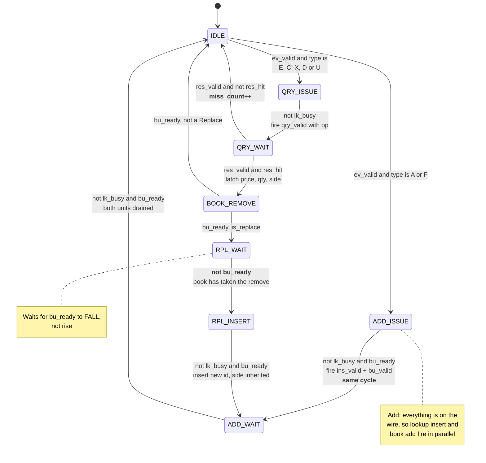

`ev_ready` is high **only in `IDLE`**, which is what enforces one event in flight
end to end. `RPL_WAIT` looks redundant and is not: the remove strobe is a
*registered* output, so `book_update` only samples it the next cycle and drops
`bu_ready` the cycle after that. Without the wait, `RPL_INSERT` reads a stale
`bu_ready = 1`, fires the step-2 add while the book is still busy, and the add is
silently dropped — the Replace's new order is lost.

> 📐 **[More `event_dispatcher` diagrams →](docs/diagrams/event_dispatcher.md)** —
> the three message paths side by side, a sequence diagram of the `RPL_WAIT` race,
> and why `order_lookup` has no `OP_REPLACE`.

<br>

---

## 4. Repository layout

```
rtl/ITCH50_parser/
├── ITCH50_pkg.sv              protocol constants, event/snapshot types
├── Itch_parser.sv             framing + per-type field extraction + symbol filter
├── Event_dispatcher.sv        all cross-module protocol logic (incl. Replace)
├── order_lookup.sv            direct-mapped order table, 2^14 entries
├── book_update.sv             per-level quantity arrays + occupancy masks
├── priority_encoder_v2/       pipelined radix-32 best-bid/best-ask encoder  ← has its own README
├── tob_tracker.sv             top-of-book snapshot assembly
├── feature_engine.sv          the six features, all in parallel, 1 cycle
├── board_link-tx.sv           15-byte frame packer
├── latency_probe.sv           non-invasive on-chip latency instrumentation
├── top_v2.sv                  engine top — transport-agnostic byte in / byte out
└── io/                        UART bring-up: uart_rx/tx, FIFO, arbiter,
                               status_reporter, top_uart, top_board (bitstream top)

rtl/eth/eth_crc32.sv           Ethernet FCS — verified, not yet instantiated
rtl/fm24_parser/               legacy custom-protocol prototype, kept for regression

tb/                            15 unit testbenches + run_all_tb.sh, run_diff.sh
src/itch_tools.py              calibration + filtering + the Python golden model
src/uart_feed.py               host-side replay and frame collection
docs/                          architecture, contract, parameters, results
docs/diagrams/                 Mermaid architecture diagrams, one per module
constraints/                   AX7A200B pin and timing constraints
create_vivado_project.tcl      builds the Vivado project from source
```

No Vivado project files are committed — the project is regenerated from the Tcl
script, so the build is reproducible from a clean clone.

<br>

---

## 5. The parser

`Itch_parser.sv` is a byte-serial decoder for the NASDAQ sample-file framing:

```
[2-byte big-endian length N][N-byte ITCH message body] [repeat...]
```

Big-endian framing is the reason the decoder is as small as it is: the first byte
received is the most significant, so a multi-byte field is assembled by shifting
each arriving byte into the low end. No byte reversal, no holding buffer.

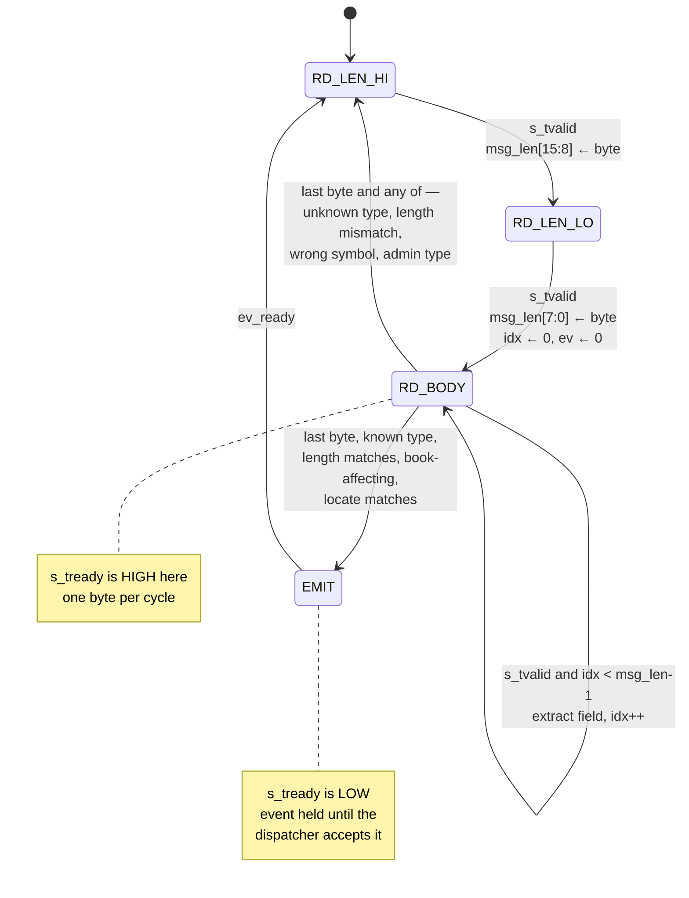

> 📐 **[More `itch_parser` diagrams →](docs/diagrams/itch_parser.md)** — the
> end-of-message decision tree with all four outcomes, and per-type field offsets.

| Message | Type | Body | Handled as |
|---|---|---|---|
| Add Order | `A` | 36 B | insert into table + add to book |
| Add Order with MPID | `F` | 40 B | same as `A`; attribution ignored |
| Order Executed | `E` | 31 B | resolve id → remove from book + **trade tap** |
| Order Executed with Price | `C` | 36 B | as `E`; execution price captured, level unmoved |
| Order Cancel | `X` | 23 B | resolve id → partial remove |
| Order Delete | `D` | 19 B | resolve id → remove *all* remaining |
| Order Replace | `U` | 35 B | decomposed into delete-old + insert-new |

Administrative messages (`S`, `R`, …) are parsed but do not touch the book.
Unknown types are counted and skipped.

**Two self-checks are built in.** For every known type the framing length prefix
must equal the spec length; a mismatch pulses `parse_error` and the event is *not*
emitted, because a length disagreement means upstream framing is misaligned and
the field offsets cannot be trusted. Separately, `stock_locate` sits at the same
byte offset in *every* ITCH message, which makes single-instrument filtering a
two-byte comparison rather than a per-type decode.

<!-- CAPTURE: Vivado simulator waveform from tb_itch_parser. Show s_tdata /
     s_tvalid / s_tready, the state register, idx, and ev_valid rising at the
     end of one 'A' message. Radix: ASCII for msg_type, hex elsewhere. -->
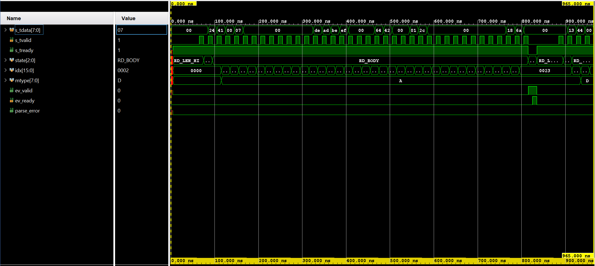

<p align="center"><em><b>Figure 2.</b> One Add Order (<code>A</code>) decoded byte by byte. <code>s_tready</code> drops only in <code>EMIT</code>, where the parser holds the event until the dispatcher accepts it — the single point of back-pressure in the core.</em></p>

**The parser is the core's bottleneck**, and deliberately so. At one byte per
cycle at 100 MHz the ingest ceiling is 100 MB/s. A 31-byte Execute costs 33
cycles to shift in, against roughly 18 for the entire rest of the pipeline. That
is the right trade for the transport actually in use — a 1 Mbaud UART leaves
1000× headroom, 100 Mbps Ethernet leaves 8× — and it is the first thing that
breaks at gigabit line rate, where a 64-bit datapath and a structurally different
parser would be required.

<br>

---

## 6. The order book

Two structures per side, both addressed by **window tick index** rather than
price:

```
level = (price − BASE_PRICE) / TICK_SIZE
```

ITCH `Price(4)` is dollars × 10,000, while US equities quote in pennies, so
consecutive real price levels are 100 units apart. Normalising once, at the book,
means every downstream difference is already denominated in ticks — which is what
lets the feature engine avoid division entirely.

- **Quantity arrays** (BRAM): aggregate shares resting at each level.
- **Occupancy masks** (distributed RAM): one bit per level, consumed by the
  priority encoder.

Out-of-window prices are dropped and counted in `oow_count`. A climbing counter
means the window is mis-centred, not that the design is broken.

### `order_lookup` — the per-order state ITCH forces on you

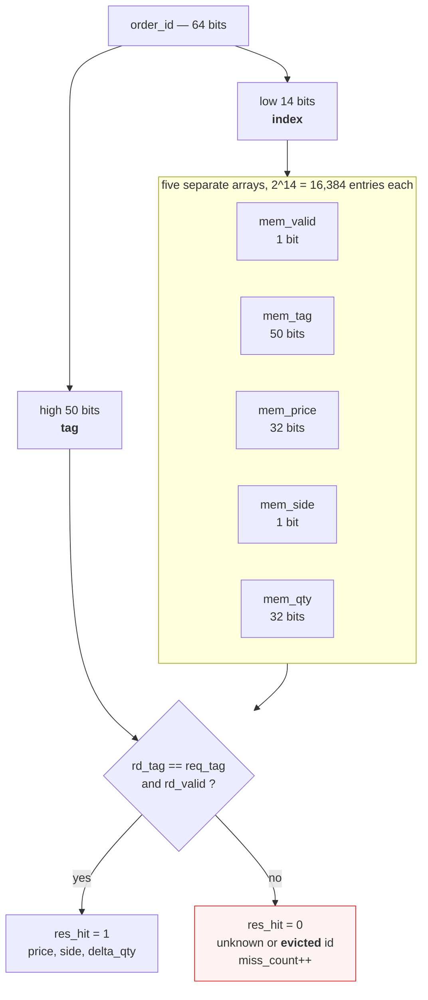

The index is the low bits of the order id with no rehashing, and collisions are
resolved by **silent overwrite** — the newest live order wins the slot, and a later
query against the evicted id reports a miss. That is a deliberate simplification,
valid because the live order count for one instrument stays well under 2¹⁴.

Five separate arrays rather than one struct array because a single packed table
would be ~1.9 Mbit, over Vivado's 1,000,000-bit per-variable elaboration limit
(`[Synth 8-4556]`). Split, each infers its own BRAM — which powers up to zero, so
`mem_valid` starts all-invalid with no reset loop.

> **The contract requires the Python model to reproduce the eviction behaviour
> exactly.** An unbounded dictionary would never miss, so it would disagree with
> hardware on every evicted order and the differential test would be meaningless.
> The 200k capture drives **14,060 agreeing evictions**.

### `book_update` — the storage

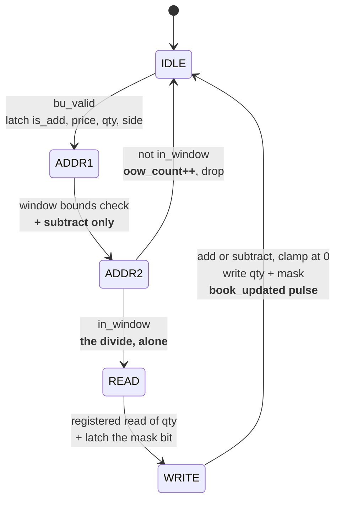

The address computation occupies **two** states because it was the design's
critical path at WNS −0.055 ns — a full 32-bit divide-by-100 did not fit in one
cycle. Splitting it fixed the problem twice over: `ADDR2` gained its own cycle,
*and* because `ADDR1` establishes in-window-ness first, the difference handed to
the divider is provably under `WINDOW_SIZE × TICK_SIZE`, narrowing it from 32 bits
to 17. See [§10.1](#101-timing).

The quantity BRAMs are never globally cleared, so the **occupancy mask is the
source of truth**: if a level's mask bit is 0, its effective old quantity is 0
regardless of what stale bits sit in the memory.

### Finding the best bid and ask

A 1024-bit occupancy mask has to yield the lowest (ask) and highest (bid) set bit
every cycle, inside a 10 ns budget. The obvious `for` loop with a `found` flag
synthesises into 1024 stages wired in series — a 63.7 ns combinational path,
about 15.7 MHz, which would cap the entire design.

`priority_encoder_v2/` replaces it with a two-level radix-32 tree: each 32-bit
leaf isolates its lowest set bit with `x & (−x)` and encodes it with five fixed
OR-reductions, and the group level picks the lowest group that reported a hit.
Depth goes from O(N) to O(log N), and `{grp_sel, local_addr}` is the final
address for free because 32 is a power of two.

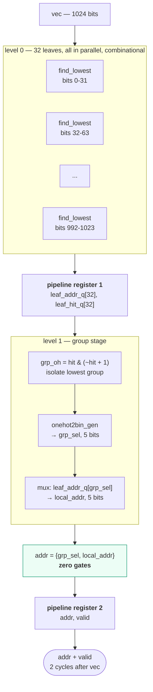

The bid side needs the *highest* set bit: the mask is reversed by pure rewiring,
the same tree finds the lowest, and the index is mapped back with
`(WINDOW_SIZE−1) − idx`. Zero gates for the reversal.

| | Radix-32 tree, 1024-bit | Ripple chain, 1024-bit |
|---|---|---|
| Latency | 2 cycles = **20 ns** @ 100 MHz | combinational, **63.7 ns** |
| Fmax | **161 MHz** | 15.7 MHz |
| LUTs | 4,546 | 3,875 |

Adding pipeline stages *reduced* wall-clock latency by 3.2×. Cycles only mean
something multiplied by a clock period you can actually achieve.

> 📐 **[More `priority_encoder` diagrams →](docs/diagrams/priority_encoder.md)** —
> the module hierarchy, the two primitives in detail, and why the naive loop is
> structurally capped at 15.7 MHz.
>
> 📄 **[Full write-up: `priority_encoder_v2/README.md`](rtl/ITCH50_parser/priority_encoder_v2/README.md)** — derivation, resource prediction vs report, scaling behaviour, and known verification gaps.

### `tob_tracker` — snapshot assembly

No FSM; a 4-bit shift register off `book_updated` with exactly two taps.

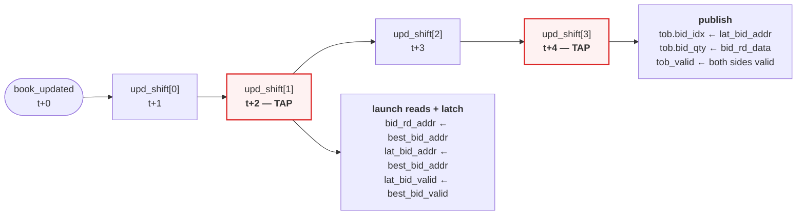

The encoder's outputs are **live combinational wires**. Latching address *and*
valid once at t+2 and reusing that copy at t+4 is what prevents a second book
update — which a Replace fires only 4–5 cycles later, right inside this window —
from pairing update #2's address with update #1's quantity. `tob_valid` is
asserted only when both sides exist, since a one-sided book has no spread or mid.

> 📐 More diagrams: **[`order_lookup` →](docs/diagrams/order_lookup.md)** ·
> **[`book_update` →](docs/diagrams/book_update.md)** ·
> **[`tob_tracker` →](docs/diagrams/tob_tracker.md)**

<br>

---

## 7. The feature engine

Every successful book update produces a candidate top-of-book snapshot. When both
sides are valid, six features are emitted together as `signed int16`, in this
frozen order:

| # | Feature | Definition | Units |
|---|---|---|---|
| 0 | `spr` | `ask_idx − bid_idx` | price ticks |
| 1 | `tobi` | `bidq − askq` | shares (difference, *not* a ratio) |
| 2 | `ofi` | `(bidq − prev_bidq) − (askq − prev_askq)` | shares |
| 3 | `emadev` | `mid2 − EMA(mid2)`, α = 1/16 | half-ticks |
| 4 | `mom` | `mid2(t) − mid2(t−8)` | half-ticks |
| 5 | `tflow` | signed sum of the last 16 trades | shares |

where `bidq = bid_qty >>> QTY_SHIFT`, `askq = ask_qty >>> QTY_SHIFT`, and
`mid2 = bid_idx + ask_idx`. **`mid2` is deliberately not halved** — it keeps
half-tick precision, so one integer unit of `emadev` or `mom` is half a price
tick. All six saturate to signed 16 bits by the same `sat16` rule, which the
Python model reproduces exactly.

All six run in **parallel**: latency from `tob_valid` to `feat_valid` is one cycle
regardless of how many features there are, because the depth is set by the
deepest single feature rather than their sum.

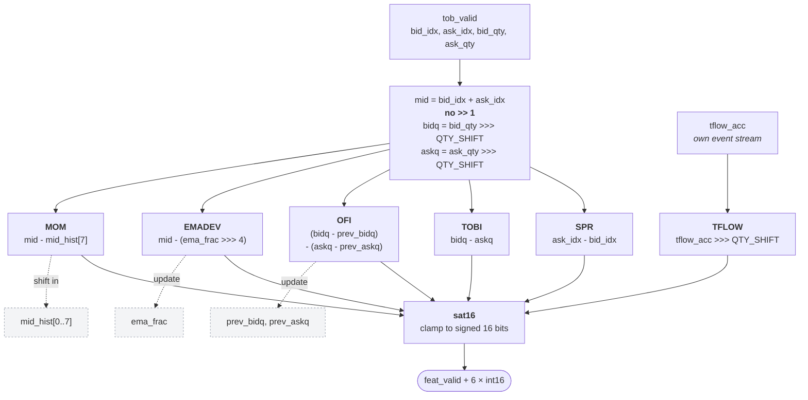

**The two input streams are independent and unsynchronised** — the structural
detail most often missed here. Snapshots drive five features; the trade tap from
the dispatcher drives only TFLOW's accumulator, in its own `always_ff` block.
TFLOW is whatever that accumulator holds when a snapshot arrives. Only the
snapshot stream produces `feat_valid`.

> 📐 **[More `feature_engine` diagrams →](docs/diagrams/feature_engine.md)** — the
> two streams drawn out, the extended-precision EMA, the MOM and TFLOW ring
> structures, and the initialisation artefacts below.

**Two initialisation artefacts are specified, not accidental.** `prev_bidq` and
`prev_askq` reset to zero, so the *first* `ofi` equals the first `tobi` rather
than zero; and the momentum history resets to eight zero slots, so the first
eight vectors compare against 0 and only the ninth onward is a true `t` vs `t−8`
difference. Both are written into the contract precisely so the golden model and
the RTL cannot quietly disagree about them.

<br>

---

## 8. The board link

Each feature vector is packed into a 15-byte big-endian frame:

| Byte | Field | Notes |
|---:|---|---|
| 0 | `SYNC` | fixed `0xA5` |
| 1 | `SEQ` | rolling frame counter, mod 256 — lets the receiver detect losses |
| 2–13 | six `int16` | `spr, tobi, ofi, emadev, mom, tflow` |
| 14 | `CHK` | XOR of bytes 0–13 |

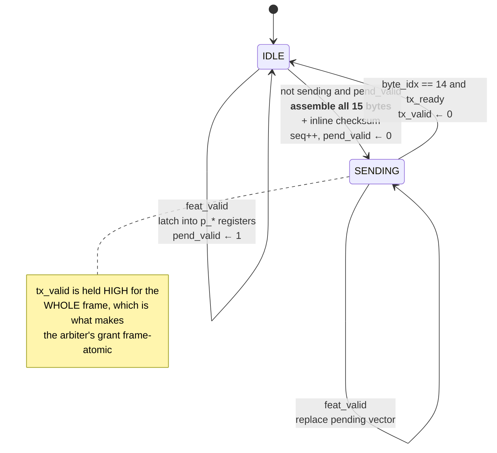

The transmitter holds **one** pending vector, not a queue. A vector arriving while
a frame is in flight replaces the pending one (drop-oldest): for a decision
engine the newest market state is strictly more valuable than a stale snapshot.
Replacements are counted in `drop_count`, and the receiver detects the resulting
gap through `SEQ`.

The checksum is computed **inline from the pending values**, not read back from the
registered frame bytes a cycle later — that would race the writes still landing,
producing frames whose checksum is right most of the time.

> 📐 **[More `board_link_tx` diagrams →](docs/diagrams/board_link_tx.md)** — the
> frame layout, drop-oldest versus a queue, receiver obligations, and the
> `drop_count` bug that a frame-for-frame match exposed.

<br>

---

## 9. Verification

### 9.1 Unit testbenches

15 testbenches, **275 assertions, 0 failures**. One command:

```bash
bash tb/run_all_tb.sh
```

<!-- CAPTURE: terminal running `bash tb/run_all_tb.sh` to completion, showing the
     green "ok" column for all 15 rows and the final summary line. -->
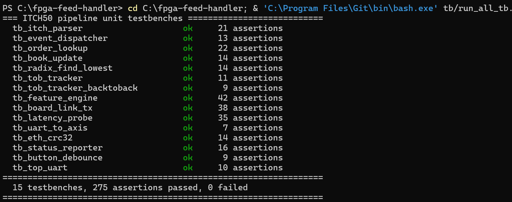

<p align="center"><em><b>Figure 3.</b> The suite a reviewer is meant to run. Exit code is 0 only if every testbench reports zero failures.</em></p>

Selected coverage:

| Testbench | Assertions | What it is really for |
|---|---:|---|
| `tb_itch_parser` | 21 | per-type field extraction; framing mismatch → `parse_error` |
| `tb_order_lookup` | 22 | **collision eviction** (`TABLE_BITS` shrunk to 4 to force it) |
| `tb_tob_tracker_backtoback` | 9 | **the Replace race** — update #2's address must not pair with update #1's quantity |
| `tb_feature_engine` | 42 | all six features, saturation boundaries, EMA seeding, init artefacts |
| `tb_latency_probe` | 35 | stage arithmetic, Replace double-fire, **overlapping measurements** |
| `tb_board_link_tx` | 38 | frame layout, checksum, sequence rollover, drop-oldest |

Two of these were validated by **mutation testing** — deliberately breaking the
RTL and confirming the testbench fails. Removing the `t+2` address latch in
`tob_tracker` makes the back-to-back test fail while the single-update test still
passes; replacing `latency_probe`'s per-stage timestamp carriers with a naive
"armed" flag fails exactly the five overlap assertions. *An assertion that has
never been observed to fail is not evidence that it works.*

### 9.2 Differential testing against an independent model

Unit tests check each module against expectations written by the same person who
wrote the module. A shared misunderstanding of the ITCH specification would pass
every one of them. Closing that hole requires a second implementation, on real
data, end to end.

```bash
bash tb/run_diff.sh aapl_200000.bin
```

| Capture | Messages | Book-affecting | Frames | Feature values | Mismatches |
|---|---:|---:|---:|---:|---:|
| `aapl_small` | 2,000 | 1,831 | 1,592 | 9,552 | **0** |
| `aapl_50000` | 50,000 | 47,879 | 31,994 | 191,964 | **0** |
| `aapl_200000` | 200,000 | 196,171 | 146,172 | 877,032 | **0** |

**Coverage matters more than volume here.** The two smaller captures contain *no
Replace messages at all* — and Replace is the most intricate path in the design,
where two of the project's real bugs lived. Only the 200k capture exercises it
(10,196 Replaces, 122 Execute-with-Price). It also drives **14,060 order-table
evictions**, which is what demonstrates that the Python model reproduces the
direct-mapped table's silent-overwrite behaviour rather than substituting an
unbounded dictionary.

### 9.3 Confirmed on silicon

The 50k capture was replayed into the board over UART at 1 Mbaud and the returned
frames diffed against the same golden model:

| | RTL simulation | **Silicon** |
|---|---:|---:|
| messages | 50,000 | **50,000** |
| unknown message types | 2,120 | **2,120** |
| order-table misses | 746 | **746** |
| out-of-window drops | 15,401 | **15,401** |
| frames emitted | 31,994 | **31,994** |
| dropped frames / parse errors | 0 / 0 | **0 / 0** |
| **feature mismatches vs golden** | **0** | **0** |

191,964 feature values, produced identically by three independent things: the RTL
in simulation, a Python model written from the specification, and an FPGA.

<!-- CAPTURE: terminal running `python src/uart_feed.py --port COM5 ...` against
     the board, showing the counter table and the final "0 mismatches" line. -->
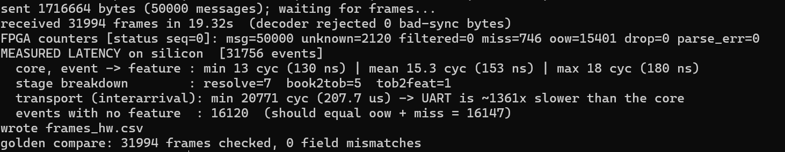

<p align="center"><em><b>Figure 4.</b> Hardware-in-the-loop replay. Every counter the FPGA reports over the status channel matches simulation exactly.</em></p>

### 9.4 An operational trap worth documenting

The first attempt at this comparison failed with 87,647 field mismatches and a
first frame showing `spr = −195` — a crossed book, which cannot happen from an
empty book. It looked exactly like an order-book bug.

It was not. The FPGA had not been reset between replays. Four independent
counters came back at *precisely* 2× their expected values, which no logic error
produces as a coincidence: the counters accumulate from reset, and the book still
held the previous run's resting liquidity while the golden model always starts
empty.

Two lessons, both of which changed the tooling:

- **Simulation always starts from reset; real devices do not.** This class of
  failure is invisible to every testbench and appears only on hardware.
- **The diagnostic counters were what solved it.** On a device with no processor
  and no debugger, the counters *are* the debugger. `uart_feed.py` now counts the
  messages in the file it sends and compares that against the FPGA's own counter,
  reporting stale state explicitly instead of printing thousands of diffs.

<br>

---

## 10. Implementation results

All figures below come from the checked-in Vivado reports for `top_board` on
`xc7a200tfbg484-2`, Vivado 2025.2, routed with a bitstream written.

### 10.1 Timing

| Metric | Value |
|---|---|
| **WNS** (setup) | **+0.333 ns** |
| Setup endpoints failing | **0 of 38,013** |
| **WHS** (hold) | **+0.068 ns** |
| Hold endpoints failing | **0 of 38,013** |
| Pulse width | +3.870 ns, 0 failing |

The design is a **single clock domain**: a 200 MHz differential input through an
`MMCME2_BASE` (VCO 1000 MHz, ÷10) to 100 MHz on a global buffer. The only
asynchronous input is the UART RX pin, resynchronised inside `uart_rx`.

<!-- CAPTURE: Vivado > Implemented Design > Report Timing Summary. Screenshot the
     summary table showing WNS/TNS/WHS/THS and the "All user specified timing
     constraints are met" banner. -->
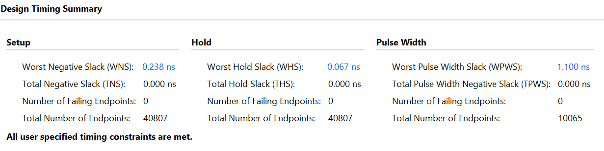

<p align="center"><em><b>Figure 5.</b> Post-route timing summary. Every constraint met with positive slack on both setup and hold.</em></p>

**The path that had to be fixed.** The price-to-address computation in
`book_update` was the critical path at WNS −0.055 ns: a full 32-bit
divide-by-`TICK_SIZE` did not fit in one cycle. Splitting it into two stages —
`ADDR1` doing the window bounds check and the subtract, `ADDR2` doing the divide
alone — fixed it twice over. Because `ADDR1` establishes in-window-ness first,
the difference fed to the divider is *provably* smaller than
`WINDOW_SIZE × TICK_SIZE`, so the divider narrowed from 32 bits to 17 as well as
gaining its own cycle.

### 10.2 Resources

| Resource | Used | Available | Util % |
|---|---:|---:|---:|
| Slice LUTs | 12,577 | 133,800 | 9.40 % |
| — as logic | 9,750 | 133,800 | 7.29 % |
| — as memory | 2,827 | 46,200 | 6.12 % |
| Slice Registers | 6,211 | 267,600 | 2.32 % |
| Block RAM tiles | 58 | 365 | 15.89 % |
| **DSP slices** | **0** | 740 | **0.00 %** |
| MMCM | 1 | 10 | 10.00 % |

<!-- CAPTURE: Vivado > Implemented Design > Device view, whole die, with the
     design highlighted. Optionally a second capture of the utilisation bar
     chart from the Project Summary. -->
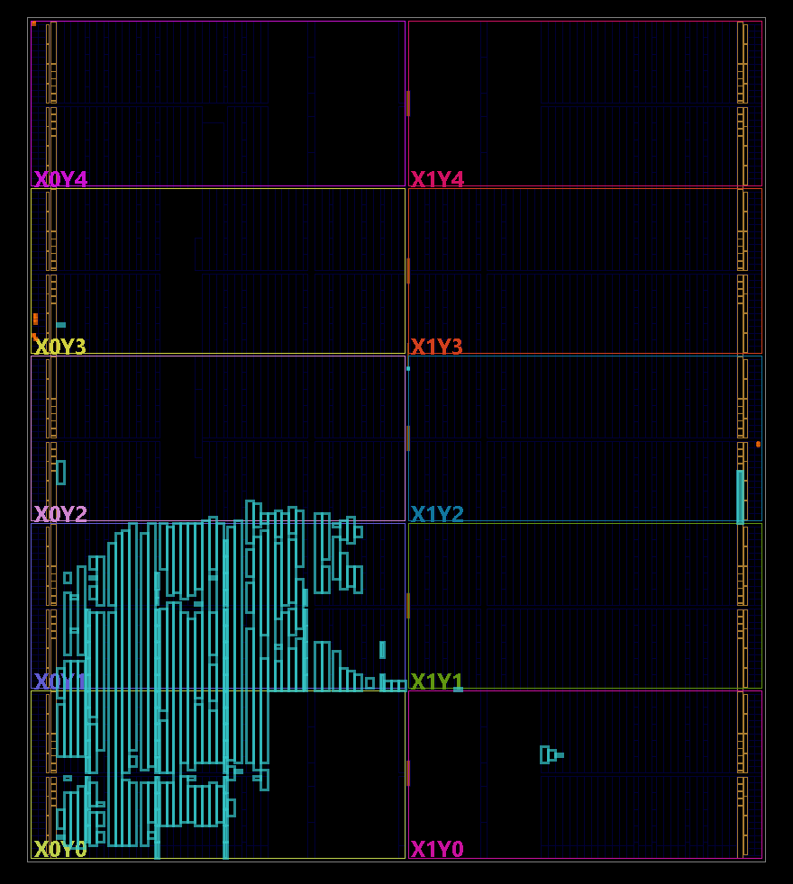

<p align="center"><em><b>Figure 6.</b> The routed design on the Artix-7 200T. The 2,827 LUTs used as memory are the two 1024-bit occupancy masks; the 58 BRAMs hold the per-level quantity arrays and the 16,384-entry order table.</em></p>

### 10.3 Latency

Quoting a latency number without saying what it spans is meaningless, so:

> **`t_total` = cycles from `ev_handoff` — the parser handing a validated event to
> the dispatcher — to the first `feat_valid` produced by that event.**

This deliberately **excludes** UART wire time and the parser's byte-shifting,
making it a property of the core pipeline rather than of whatever transport
happens to be feeding it.

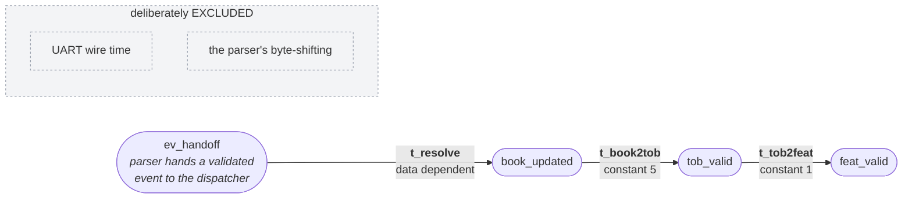

Each stage latches its **own copy** of the originating timestamp rather than
sharing one "armed" flag. That is necessary, not defensive: the dispatcher returns
to `IDLE` and can accept the next event roughly 5 cycles *before* the current
event's feature emerges, so a single flag would be clobbered whenever the feed runs
near line rate.

> 📐 **[More `latency_probe` diagrams →](docs/diagrams/latency_probe.md)** — the
> timestamp carriers, the Replace and abandoned-event cases, interarrival
> measurement, and how the probe doubles as an assertion.

Measured on silicon over 31,756 events of real ITCH data:

| | Cycles | @ 100 MHz |
|---|---:|---:|
| min | 13 | **130 ns** |
| mean | 15.3 | **153 ns** |
| max | 18 | **180 ns** |

| Stage | Cycles | Set by |
|---|---:|---|
| `t_resolve` | 7 (data-dependent) | dispatcher FSM + `order_lookup` + `book_update` |
| `t_book2tob` | **5** | encoder pipe (2) + address settle (1) + registered read (1) + output register (1) |
| `t_tob2feat` | **1** | `feature_engine`, all six features in parallel |

**The two fixed stages were predicted before they were measured.** Both are
fixed-latency chains with no data dependence, so their values were derived from
the RTL first — 5 and 1 — and any other result would have been a bug rather than a
measurement. They came back as 5 and 1 in simulation, and again as 5 and 1 on
hardware. The probe therefore doubles as an online correctness check, not merely
an instrument.

### 10.4 Why there is no end-to-end number

The bring-up transport is a 1 Mbaud UART: 10 bits per byte, 10 µs per byte,
100 KB/s. Both halves of the comparison below are **measured on the same chip, on
the same clock, in the same run** — the probe records the interval between
consecutive events, which under UART *is* the transport cost:

| | Measured |
|---|---:|
| core, event → feature | **153 ns** |
| transport, minimum interarrival | **207.9 µs** |
| ratio | **~1,363×** |

Any end-to-end figure from this bitstream would be a measurement of the UART, not
of the feed handler. UART was chosen for bring-up because it minimises
time-to-first-observation: two wires, an existing USB bridge, no MAC, no PHY
negotiation, no DMA descriptors, no host driver. It is the right transport for
verifying correctness and the wrong one for demonstrating throughput.

<br>

---

## 11. Getting started

One USB-UART carries the ITCH feed in and both frame types out:

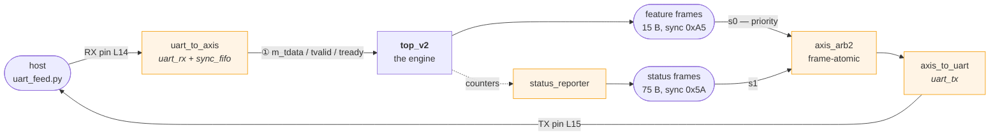

Status frames are triggered by the **RX line going quiet**, never by an in-band
command byte — the ITCH stream can contain any byte value inside a price, order id
or timestamp field, so a magic byte would eventually collide with real data and
desynchronise the framing permanently.

> 📐 **[More IO layer diagrams →](docs/diagrams/io_uart.md)** — `top_board`'s clock
> and reset generation, why 1 Mbaud, the three active-low bring-up LEDs, and
> frame-atomic arbitration.

### Prerequisites

- Vivado 2025.2 (the simulator `xsim` is enough for everything except the bitstream)
- Python 3.8+ — the golden model uses **only the standard library**
- `pyserial`, for hardware replay only
- A NASDAQ TotalView-ITCH 5.0 capture file

### Run the testbenches

```bash
git clone https://github.com/Rushmello369/fpga-feed-handler.git
cd fpga-feed-handler
bash tb/run_all_tb.sh
```

`run_tb.sh` locates the Vivado installation automatically; override it with
`export VIVADO_BIN=/path/to/Vivado/bin` if it lives somewhere unusual.

### Run the differential test

```bash
bash tb/run_diff.sh aapl_50000.bin
```

Simulates `top_v2` on the capture, regenerates the golden model **at the same
parameters**, and diffs every feature column. Exit code 0 only if every frame
matches.

### Build the bitstream

```bash
vivado -mode batch -source create_vivado_project.tcl
```

then, in the Vivado Tcl console:

```tcl
launch_runs synth_1 -jobs 8 ; wait_on_run synth_1
launch_runs impl_1  -jobs 8 ; wait_on_run impl_1
```

### Replay a capture through the board

```bash
python src/itch_tools.py filter capture.bin --locate 14 --out stream.bin
python src/uart_feed.py --port COM5 --baud 1000000 \
       --send stream.bin --recv-csv frames_hw.csv --golden golden.csv
```

**Reset the board between replays.** The counters accumulate from reset and the
book retains resting liquidity — see [§9.4](#94-an-operational-trap-worth-documenting).

<br>

---

## 12. Calibration

Three parameters are **re-derived per instrument and per trading day**. Changing
any of them invalidates previously generated golden data.

| Parameter | Bitstream value | Source | Symptom if wrong |
|---|---|---|---|
| `BASE_PRICE` | 1,610,800 | `itch_tools.py calibrate` | `oow_count` climbs — the window is not centred where the instrument traded |
| `WINDOW_SIZE` | 1024 | same run | too small → drops; too large → wasted BRAM and a wider encoder |
| `FILTER_LOCATE` | 14 | that day's Stock Directory (`R`) message | the wrong instrument is processed |

```bash
python src/itch_tools.py calibrate capture.bin --ticker AAPL
```

At `BASE_PRICE = 1,610,800` and 1024 penny ticks, the window covers
**\$161.08 – \$171.31**. `stock_locate` is assigned per trading day by NASDAQ and
**must never be hard-coded across days**.

> ### ⚠️ The same parameter has three different defaults
>
> `BASE_PRICE`, `WINDOW_SIZE` and the filter settings are declared with
> *different* defaults at three levels of the hierarchy. **Only `top_board`'s
> values reach the bitstream** — it overrides every one on the way down, and the
> synthesis log confirms it. But elaborating `top_v2` or `tb_top_v2` directly
> picks up a 2048-tick window centred on \$155.00 with symbol filtering
> *disabled*: a materially different design. A simulation-versus-hardware
> discrepancy originating here is very hard to diagnose, because nothing looks
> wrong in either. When comparing the two, always elaborate from `top_board` or
> pass the calibration values explicitly.
>
> Full table and rationale: [`docs/parameters.md`](docs/parameters.md).

<br>

---

## 13. Limitations and roadmap

**What these results cover:** feed → parse → order book → six features → framed
byte stream, plus a diagnostic read-back channel, on real silicon against real
NASDAQ ITCH 5.0 capture data, for a **single instrument** within a **1024-tick
price window**.

**What they do not cover, and why:**

| Not implemented | Status |
|---|---|
| Ethernet MAC / PHY ingress | `eth_crc32` is written and verified (14 assertions) but not instantiated |
| PCIe / XDMA endpoint | not started; UART substitutes for bring-up |
| Board-to-board physical link | frame format frozen; PMOD pins, electrical layer and CDC undefined |
| Pynq Z1 receiver + FINN accelerator | not started |
| Risk core, order-entry encoder | not started |
| Multi-symbol support | the book is single-instrument by construction |

Two known verification gaps in the priority encoder — parameterisation is
synthesised but never simulated at widths other than 1024, and there is no
randomised testing — are documented in that module's own README rather than
glossed over.

<br>

---

## 14. Documentation index

| Document | Contents |
|---|---|
| [**`docs/diagrams/`**](docs/diagrams/) | **Mermaid architecture diagrams**, generated from the RTL — system level plus one per module |
| [`docs/handler_contract.md`](docs/handler_contract.md) | **Frozen.** Feature definitions, order, widths, saturation, sampling. The authority when RTL, model and docs disagree |
| [`docs/parameters.md`](docs/parameters.md) | Every parameter by *who owns it and what breaks when it changes* |
| [`docs/results.md`](docs/results.md) | Full measured results, with sources and reproduction commands |
| [`docs/module_ports.md`](docs/module_ports.md) | Port reference — five interface patterns, every module |
| [`docs/architecture.md`](docs/architecture.md) | System context and implementation status |
| [`docs/board_link_spec.md`](docs/board_link_spec.md) | Frame format, handshake, receiver requirements |
| [`rtl/ITCH50_parser/priority_encoder_v2/README.md`](rtl/ITCH50_parser/priority_encoder_v2/README.md) | Deep dive on the radix-32 encoder |

**Change rule.** The feature definitions, `QTY_SHIFT`, `TABLE_BITS`, the sampling
point and the frame layout are contract-frozen. Changing any of them is an
interface change and requires a synchronised update to the contract, the RTL,
`itch_tools.py`, the affected testbenches, and the dataset version — in one
commit. Never "fix" the reference model to agree with the DUT; that destroys the
only independent check there is.

<br>

---

## References

- NASDAQ, *TotalView-ITCH 5.0 Specification*
- Lockwood et al., *A Low-Latency Library in FPGA Hardware for High-Frequency Trading*
- Leber, Geib & Litz, *High Frequency Trading Acceleration using FPGAs*
- Denholm et al., *Low Latency FPGA Acceleration of Market Data Feed Arbitration*

<br>

## License

<!-- TODO: pick one. MIT is the usual default for a portfolio/academic repo. -->
