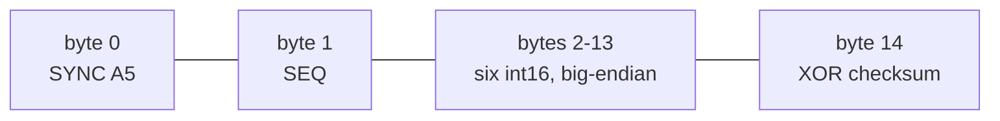
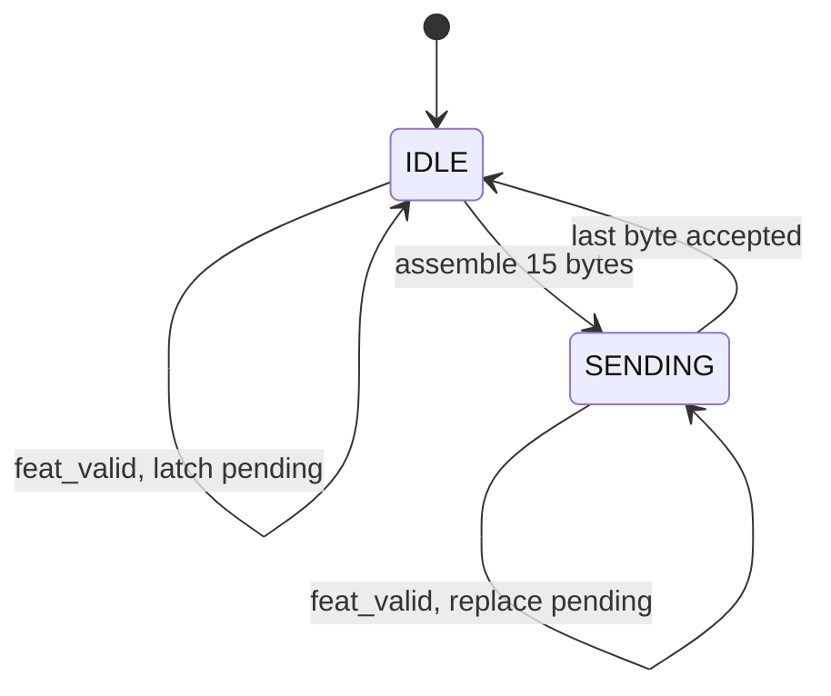
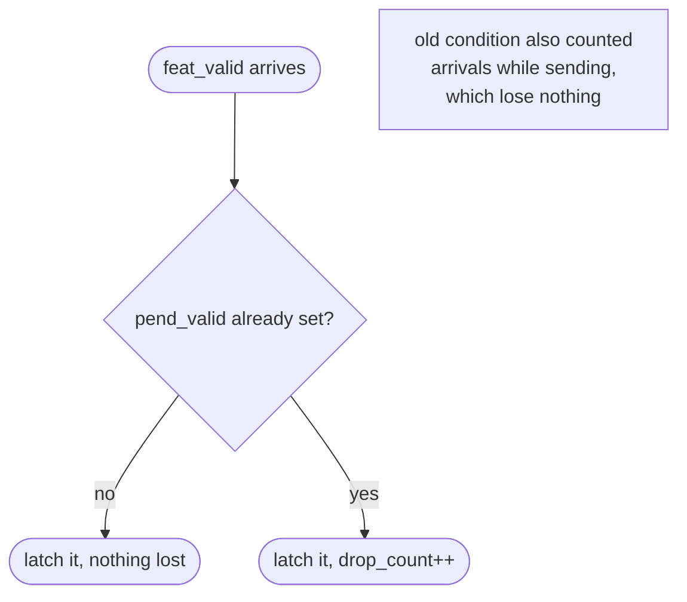
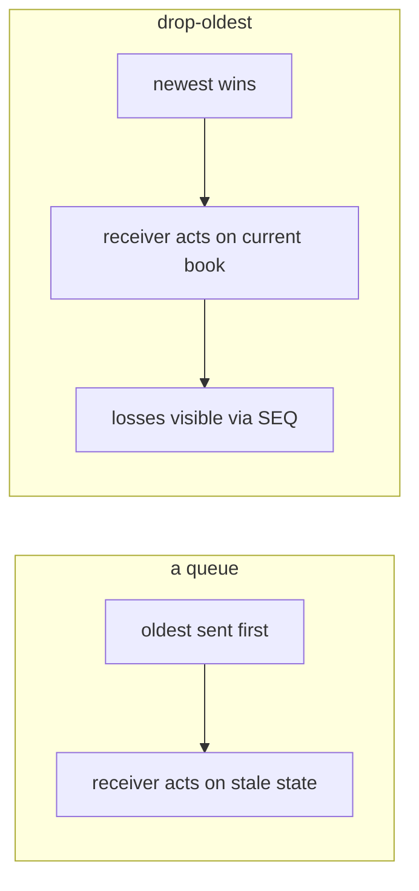
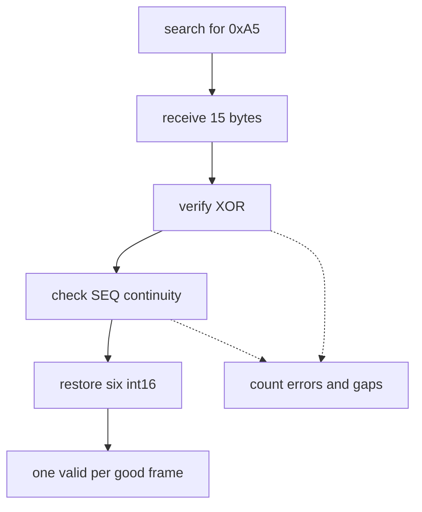

# `board_link_tx`

Packs one feature vector into a 15-byte frame and serialises it. Source:
[`rtl/ITCH50_parser/board_link-tx.sv`](../../rtl/ITCH50_parser/board_link-tx.sv)

[← back to README](../../README.md#8-the-board-link)

---

## 1. Frame layout

Six `signed int16`, **big-endian**, in frozen order. Big-endian to stay consistent
with the ITCH convention used everywhere else in the design, and with the golden
model's `struct.pack('>6h')`.

`SEQ` is the improvement over a sequence-less link: the receiver detects a lost
frame from a gap rather than never knowing.

## 2. Transmit flow

Not an enumerated FSM — two flags, `sending` and `pend_valid`.

**The checksum is computed inline from the pending values**, not from the
registered frame bytes on the following cycle. Reading back `frame[]` one cycle
later to XOR it would race the writes that are still landing — a subtle bug that
would produce frames whose checksum is right most of the time.

## 3. Drop-oldest, and the counter bug this exposed

One pending vector, no queue.

**How the bug was caught.** A 200k-message replay reported `drop_count = 2160`
while emitting exactly **146,172 frames — the same count as the golden model, with
zero mismatches**. A frame-for-frame match is arithmetically impossible if 2,160
vectors had genuinely been lost. So the counter, not the datapath, was wrong.

Fixing the condition to `pend_valid` alone took `drop_count` from 433 → **0** on
the 50k capture, with frame count and every feature value unchanged.

**The testbench had encoded the bug.** `tb_board_link_tx` asserted
`drop_count == 2` for a sequence that drives three vectors and emits two frames —
while its *own* frame assertions in the same block verified that the second frame
carries the **third** vector, proving exactly one was lost. The two assertions
contradicted each other, and the frame assertions were right.

> A diagnostic counter that disagrees with the datapath is a bug in the counter
> until proven otherwise — but only if you notice the disagreement. Here the frame
> count was the independent check that made it visible.

## 4. Why drop-oldest rather than a FIFO

For a decision engine the newest market state is strictly more valuable than a
stale snapshot, so there is nothing to gain from queueing. The requirement this
creates on the consumer side is that **`drop_count` must be recorded alongside any
ML replay or latency report** — a run with drops cannot be described as
per-event-complete inference.

## 5. Receiver obligations

Full definition in [`board_link_spec.md`](../board_link_spec.md). The frame format
is **frozen**; the physical layer — PMOD pin assignment, serial or parallel PHY,
and the CDC between the two boards' asynchronous clock domains — is not yet
defined. UART currently substitutes for the link.

Verified by `tb_board_link_tx` — **38 assertions**: frame layout, checksum,
sequence rollover, and drop-oldest under back-pressure.
