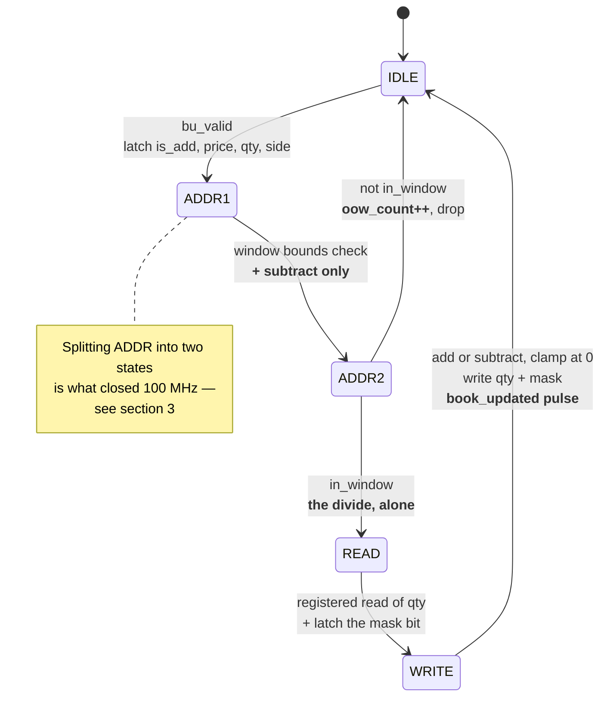
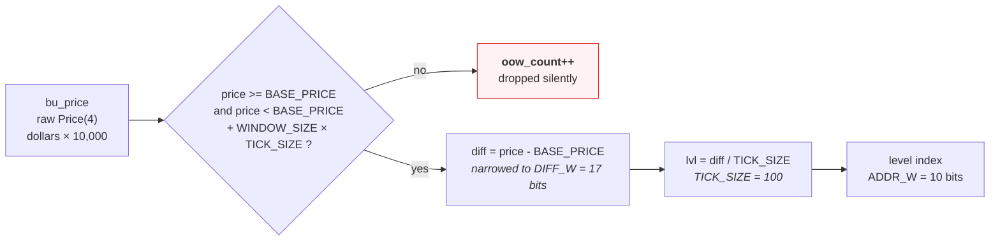
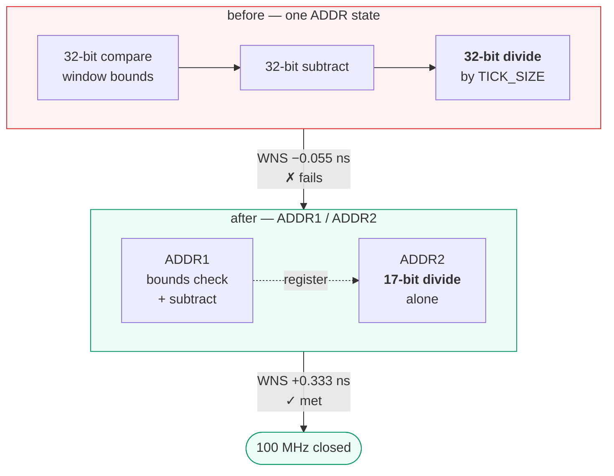
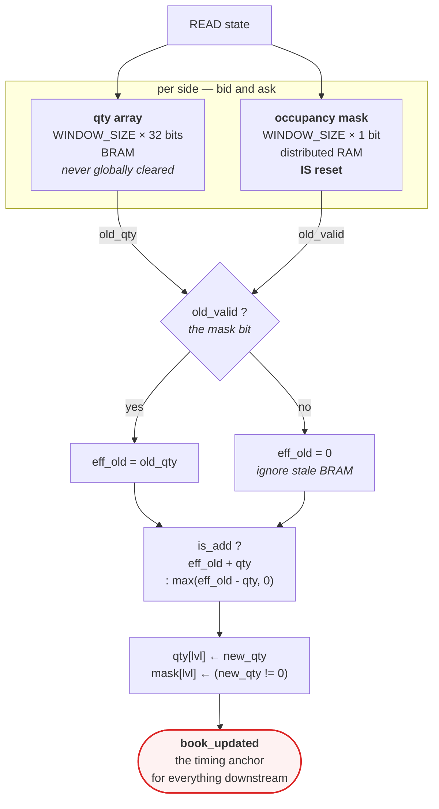
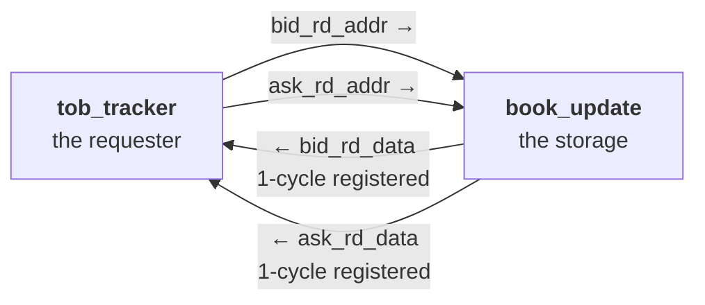

# `book_update`

Aggregate price-level order book: per-level quantities plus the occupancy masks
the priority encoder consumes. Source:
[`rtl/ITCH50_parser/book_update.sv`](../../rtl/ITCH50_parser/book_update.sv)

[← back to README](../../README.md#6-the-order-book)

---

## 1. State machine

Five states, 5 cycles per update, one in flight. `bu_ready = (state == IDLE)`.

## 2. Address computation

ITCH `Price(4)` has four implied decimals, but US equities quote in pennies — so
consecutive *real* price levels are 100 units apart. Normalising once, here, means
every downstream difference is already denominated in ticks, which is what lets
the feature engine avoid division entirely.

At `BASE_PRICE = 1,610,800` and `WINDOW_SIZE = 1024`, the window covers
**\$161.08 – \$171.31**.

## 3. The critical path, and how it was fixed

This address computation was the design's critical path at **WNS −0.055 ns**.

**The fix worked twice over, and that is the interesting part.** Splitting the
state gave the divide its own cycle — but because `ADDR1` establishes
in-window-ness *first*, the difference handed to `ADDR2` is provably smaller than
`WINDOW_SIZE × TICK_SIZE`. So the divider narrowed from 32 bits to
`DIFF_W = $clog2(WINDOW_SIZE × TICK_SIZE)` = **17 bits** as well as gaining a
cycle. Both effects together produced the positive slack.

## 4. Storage, and why the mask is the source of truth

**BRAM contents have no reset.** The quantity arrays power up holding whatever
they hold and are never cleared en masse — clearing 1024 levels would take 1024
cycles, and there is nothing to clear them *for*. The occupancy mask *is* reset, so
it is the authority: if a level's mask bit is 0, its effective old quantity is 0
regardless of what stale bits sit in the memory. `old_valid` is latched in `READ`
for exactly this purpose.

The clamp on the subtract exists because a remove larger than what is resting
signals an upstream inconsistency, and a wrapped 32-bit quantity would corrupt the
book permanently rather than transiently.

## 5. Two independent read ports

> **Read-port direction is the most commonly reversed thing in this design.**
> Address is an *input* to `book_update`; data is an *output*. These ports are
> driven unconditionally every cycle, independent of the FSM, which is the standard
> BRAM inference pattern.

Verified by `tb_book_update` — **14 assertions**: add and remove, zero clamping,
out-of-window drop counting, and mask/quantity coherence.
