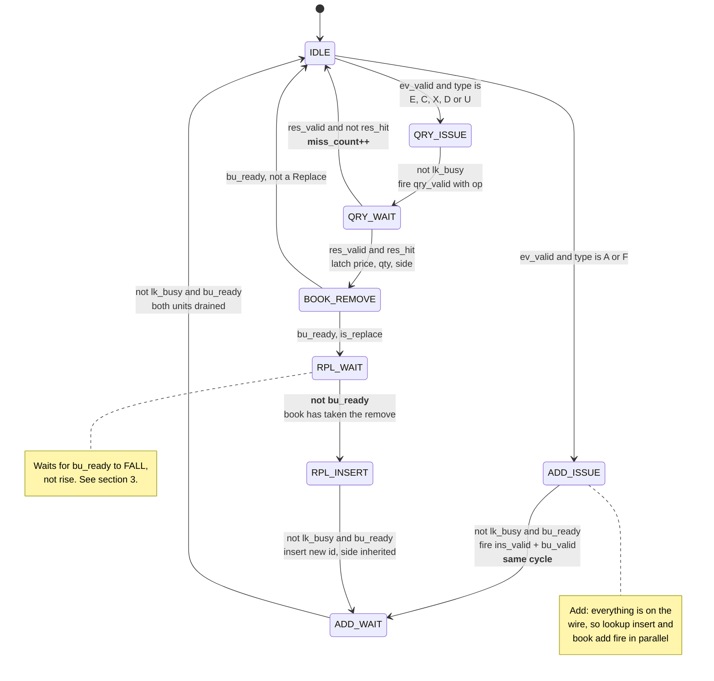
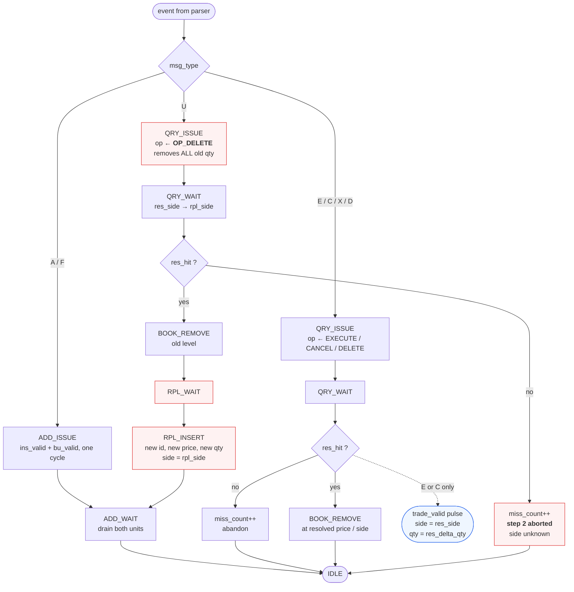
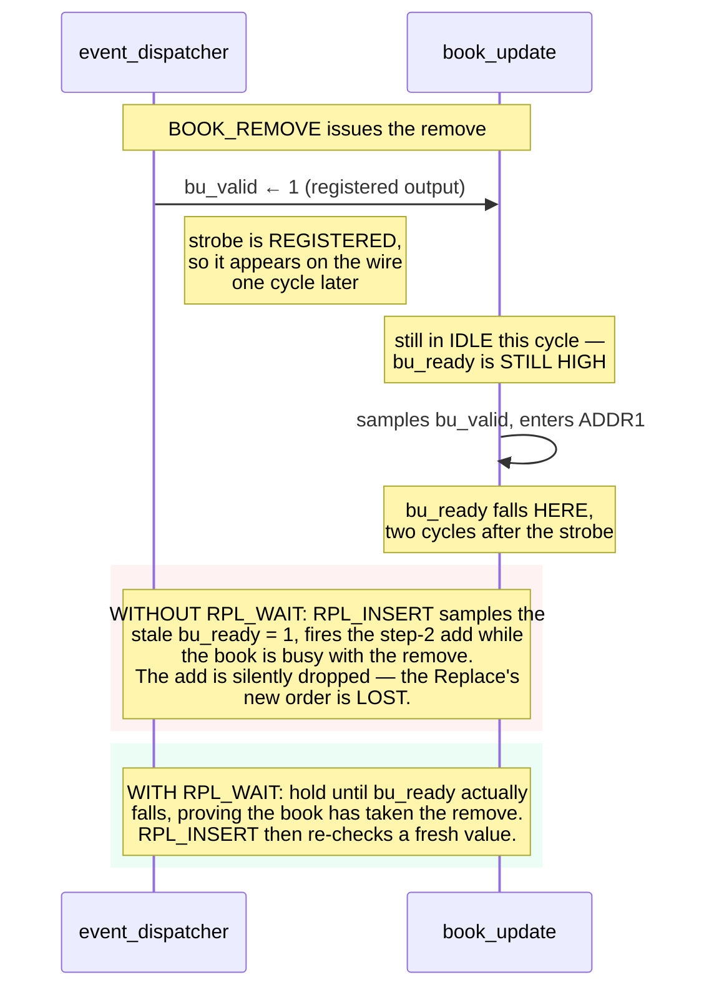
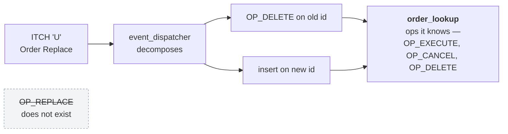

# `event_dispatcher`

The traffic controller between `itch_parser`, `order_lookup` and `book_update`.
It owns **all** the protocol logic that spans modules. Source:
[`rtl/ITCH50_parser/Event_dispatcher.sv`](../../rtl/ITCH50_parser/Event_dispatcher.sv)

[← back to README](../../README.md#3-architecture)

---

## 1. State machine

Eight states, three paths. `ev_ready` is high **only in `IDLE`**, which is what
enforces one event in flight end to end.

## 2. The three paths, side by side

**Why Cancel and Delete differ.** `X` carries the number of shares cancelled, so
the lookup subtracts that amount. `D` carries **no quantity at all** — the only
way to know how much to remove from the book is the remaining live quantity the
order table has been tracking, which is why `OP_DELETE` returns `rd_qty` rather
than a wire value.

**Why the trade tap is Execute-only.** `trade_valid` fires on `E` and `C` hits and
nothing else. A cancellation is not a trade, and neither is a replace. The side
comes from `res_side` because execution messages never carry one.

## 3. The `RPL_WAIT` state, and the bug it exists to prevent

`RPL_WAIT` looks redundant — it waits for `bu_ready` to go *low*. Removing it
breaks Replace silently.

This is the class of bug that passes every module-level test written against the
module's own assumptions, because both the dispatcher and the book behave exactly
as documented in isolation. It shows up only when the two are composed and an
event produces two back-to-back book commands — which is to say, only on Replace,
which the two smaller test captures contain none of.

## 4. What `order_lookup` is deliberately not told

There is no `OP_REPLACE` in `lookup_op_e`. Replace is a composition of two
primitives the table already supports, so the table stays a table — and the one
piece of protocol subtlety, that the side has to be recovered from the delete half
before the insert half can be issued, lives in exactly one place.
