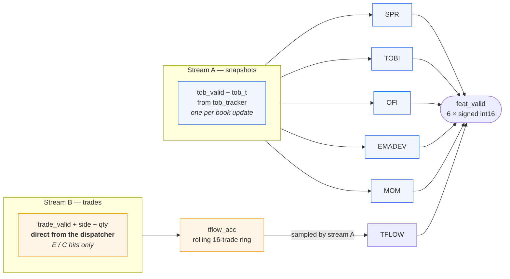
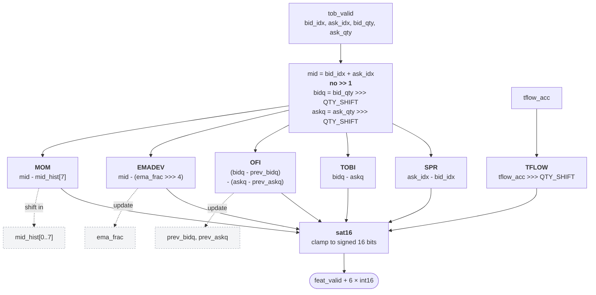
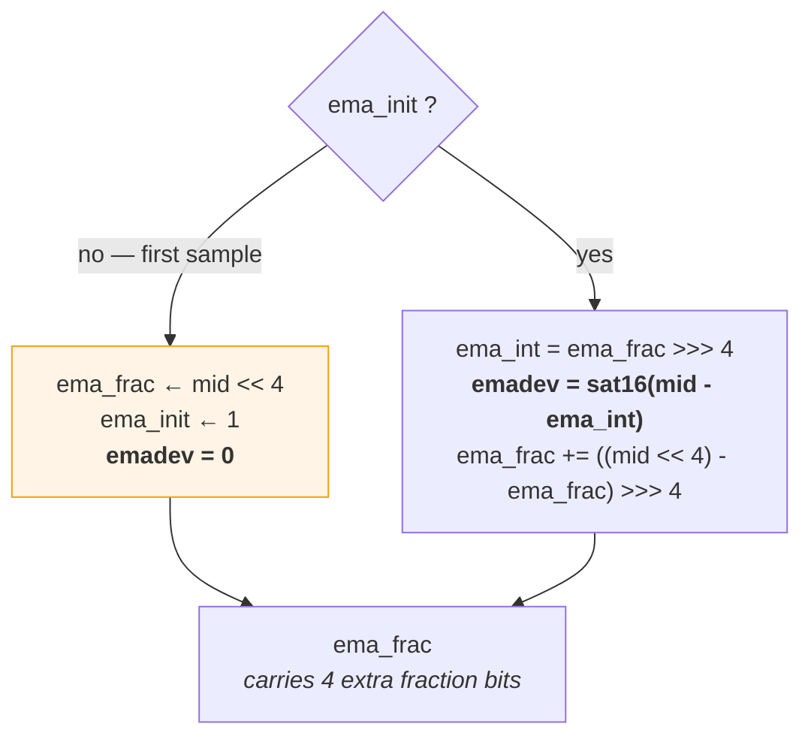
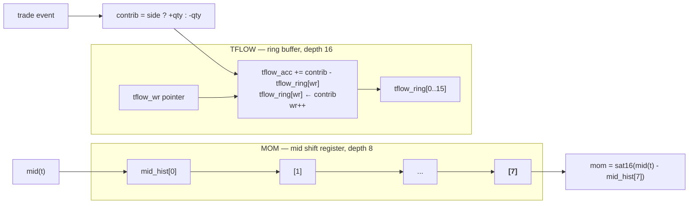
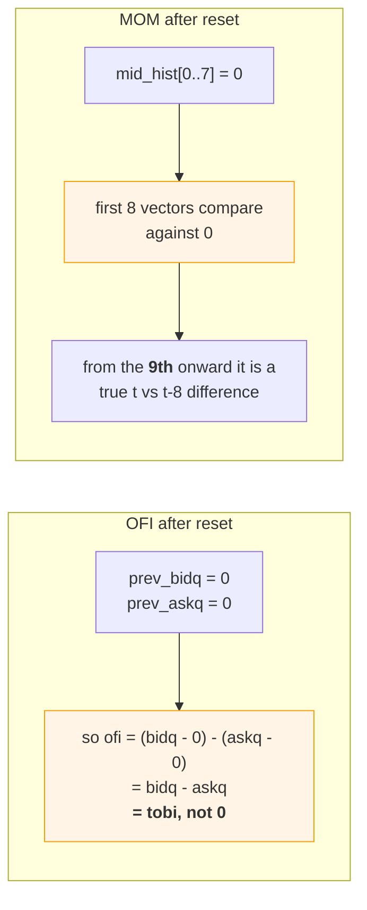
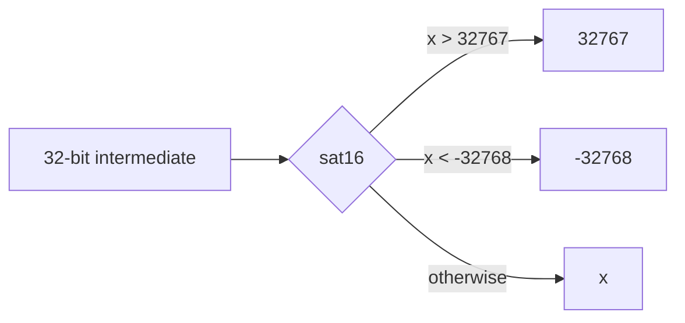

# `feature_engine`

Six features from each top-of-book snapshot, computed with adds, subtracts and
shifts only. Source:
[`rtl/ITCH50_parser/feature_engine.sv`](../../rtl/ITCH50_parser/feature_engine.sv)

[← back to README](../../README.md#7-the-feature-engine)

---

## 1. Two independent input streams

The structural detail most often missed in this module: the snapshot stream and
the trade stream are **unsynchronised**, and they drive different features.

The trade accumulator updates in its own `always_ff` block, on its own event
stream. TFLOW is whatever that accumulator happens to hold when a snapshot
arrives. Only Stream A produces `feat_valid`.

## 2. The six datapaths, all in parallel

One cycle from `tob_valid` to `feat_valid`, regardless of feature count — the
depth is set by the deepest single feature, not their sum.

**No multiplier, no divider, anywhere.** Three choices make that possible:

1. Prices arrive as **window tick indices**, so `ask_idx − bid_idx` is already the
   spread in ticks — nothing to scale.
2. Imbalance is defined as a **difference, not a ratio** — TOBI is `bidq − askq`,
   not `bidq / (bidq + askq)`.
3. The EMA coefficient is **1/16**, so the update is a pure arithmetic shift.

The utilisation report proves it: **0 of 740 DSP slices**.

## 3. EMADEV — the extended-precision EMA

**Why the 4 extra fraction bits.** An EMA whose state is a plain integer loses the
fractional part on every `>>> 4`, and repeated truncation bleeds precision until
the average drifts. Keeping the state as `ema << 4` and doing the update in the
extended domain confines the rounding to one place.

**Why seeding matters.** Without it, the first sample would be compared against an
EMA of zero, producing a `mid`-sized spike that has nothing to do with market
behaviour. The first snapshot seeds instead and reports `emadev = 0`.

## 4. MOM and TFLOW — the two ring structures

The TFLOW ring is what keeps the window rolling without a re-sum: add the newest
contribution, subtract the one leaving. Constant work per trade, no matter the
depth.

**TFLOW sign convention.** `trade_side` is the **resting** order's side, from
`order_lookup`. A resting sell being lifted means an aggressive *buy*; a resting
buy being hit means an aggressive *sell*. TFLOW is positive for aggressive buying,
so `contrib = resting_side ? +qty : −qty`.

## 5. Two initialisation artefacts — specified, not accidental

Both are written into [`handler_contract.md`](../handler_contract.md) precisely so
the RTL and the Python model cannot quietly disagree about them. An "obvious" fix
in either implementation — zeroing the first OFI, or suppressing the first eight
MOM values — would break the differential test, and the contract is what settles
which side is wrong.

## 6. Saturation

All intermediate arithmetic is 32-bit; only the output is narrowed. Every shift is
**arithmetic** (`>>>`), so negative values keep their sign.

`mid2 = bid_idx + ask_idx` is deliberately **not** halved, which keeps half-tick
precision for free. The consequence to remember: one integer unit of EMADEV or MOM
is **half a price tick**, not a whole one.

Verified by `tb_feature_engine` — **42 assertions**: all six features, saturation
boundaries, EMA seeding, and both initialisation artefacts above.
