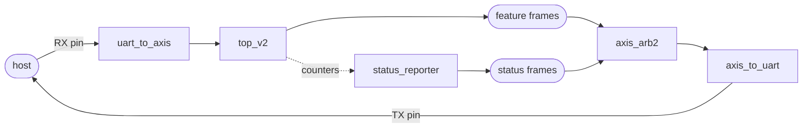
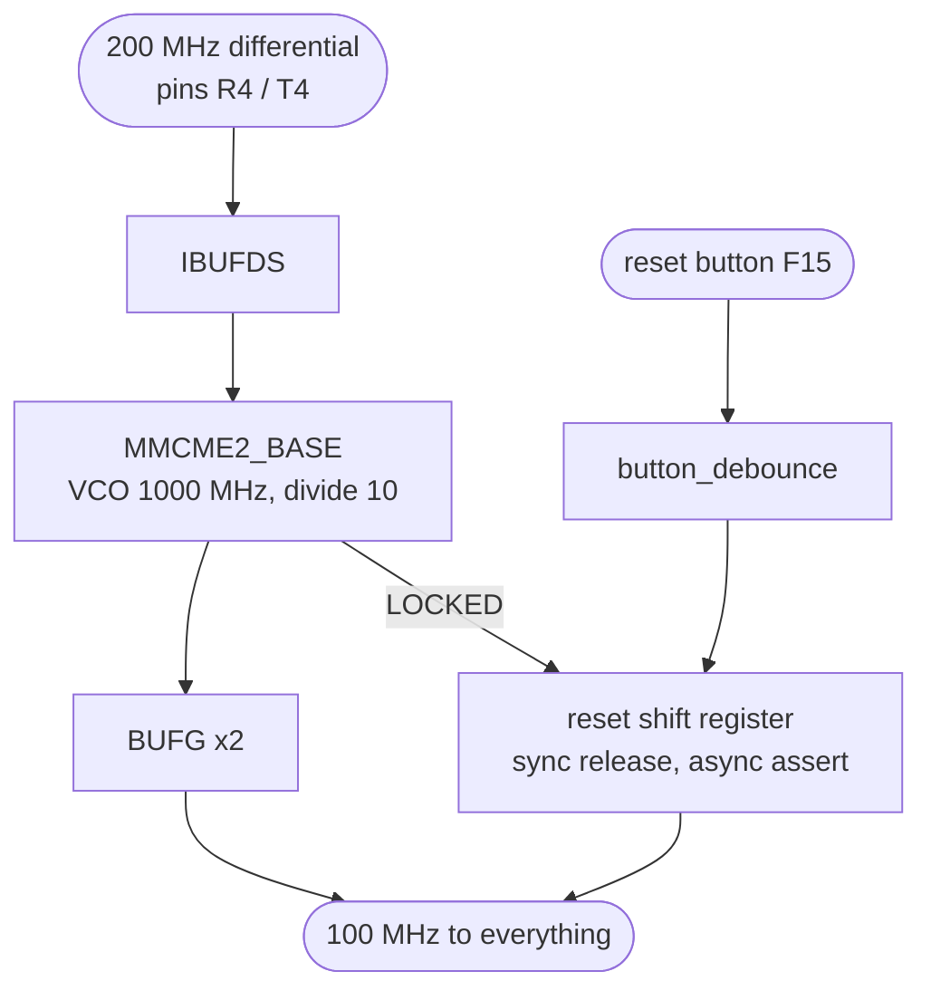
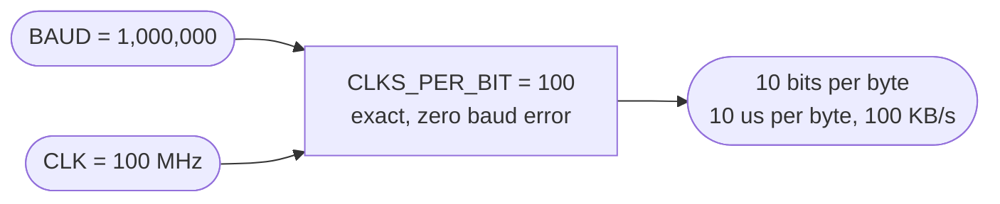
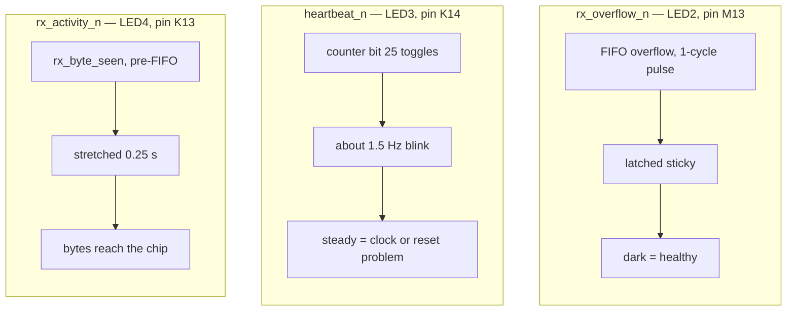
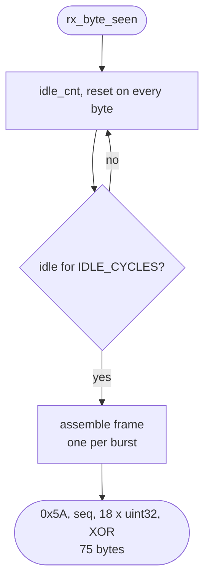
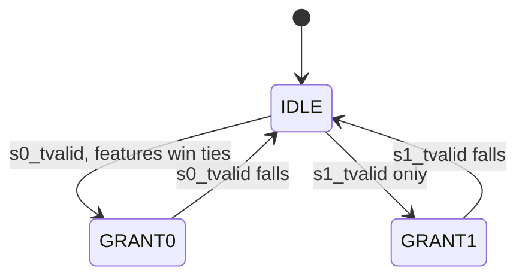

# IO layer — `top_board`, `top_uart` and the UART bring-up

The transport and board wrapper around the engine. Source:
[`rtl/ITCH50_parser/io/`](../../rtl/ITCH50_parser/io/)

[← back to README](../../README.md#11-getting-started)

---

## 1. Full-duplex path

One USB-UART carries the ITCH feed in and both frame types out.

No PS, no DMA, no Ethernet — the shortest path to seeing the whole datapath run on
real silicon against historical data.

## 2. Clock and reset generation in `top_board`

**The VCO value is not free** — it must sit inside the Artix-7 −2 legal range,
roughly 600–1600 MHz. **Reset release is synchronous** via the shift register so
every flop leaves reset on the same edge, while assertion is immediate. There is no
external reset pin needed: reset is held until the MMCM actually locks, because
running the pipeline on an unstable clock is never correct.

`button_debounce` has **no `arstn` by design** — it *produces* the reset, so it
cannot depend on one. It relies on register initial values loaded at FPGA
configuration.

## 3. Baud choice

Must equal the host's baud (`uart_feed.py --baud 1000000`). 1 Mbaud divides 100 MHz
exactly, which is why it was chosen over a faster non-integer divisor.

## 4. The three bring-up LEDs

> **These pins are active-low: driving 0 lights the LED.** Hence the `_n` suffixes
> and the inversions. The pin-to-LED mapping is also **shifted by one** from what the
> board user guide suggests — determined empirically with `bringup/led_test.sv`,
> which drives the three pins at three distinguishable rates.

**Why overflow is latched.** `sync_fifo`'s `overflow` is a 1-cycle pulse — 10 ns —
so wiring it straight to a pin produced an indicator that could never be seen by
eye and therefore *always looked healthy*. An error light has to report "this ever
happened", not "this is happening right now".

## 5. Status frames — triggered by silence, not a command byte

**Why not an in-band command byte.** The inbound ITCH stream is a continuous
`[length][body]` sequence in which **any** byte value can occur inside a price,
order id or timestamp field. A magic byte would eventually collide with real data
and desynchronise the framing permanently. Watching for the RX line to go quiet
cannot corrupt the datapath, and it fires at exactly the moment the host wants the
counters: the end of a replay burst.

`IDLE_CYCLES` must **exceed the host's inter-byte gap**, or a pause mid-burst is
mistaken for end-of-burst and extra frames are emitted. Testbenches override it
with a tiny value.

The counters arrive as one flattened `cnt_bus` rather than named ports, packed
MSB-first so the frame is big-endian by construction. That keeps `status_reporter`
agnostic about what is being reported — adding a counter is a change in `top_uart`
and the host decoder, not here.

> **`stat_bus`'s concatenation order *is* the wire format.** `uart_feed.py`'s
> `STATUS_FIELDS` list must match it element for element. Adding a counter means
> editing both, in the same commit.

## 6. Frame-atomic arbitration

Both producers hold `tvalid` high for a whole frame and drop it only at the frame
boundary. So "grant a source until its `tvalid` falls" **is** frame granularity —
the two frame types can never interleave or tear on the wire. Without this the host
would see a `0xA5` feature frame with status bytes spliced into it.

Priority only decides who starts when both are waiting and the mux is idle.

## 7. FIFO sizing

`sync_fifo` is first-word-fall-through, `DW = 8`, `AW = 6` → **depth 64**.

It only needs to absorb the parser's brief `EMIT` back-pressure. Under UART a byte
arrives every ~1000 clocks, so the FIFO never approaches full — `rx_overflow` going
sticky would mean something structurally wrong, which is exactly why it is worth an
LED.

Verified by `tb_uart_to_axis` (7 assertions), `tb_status_reporter` (16),
`tb_button_debounce` (9), and `tb_top_uart` (10, full pipeline end to end).
