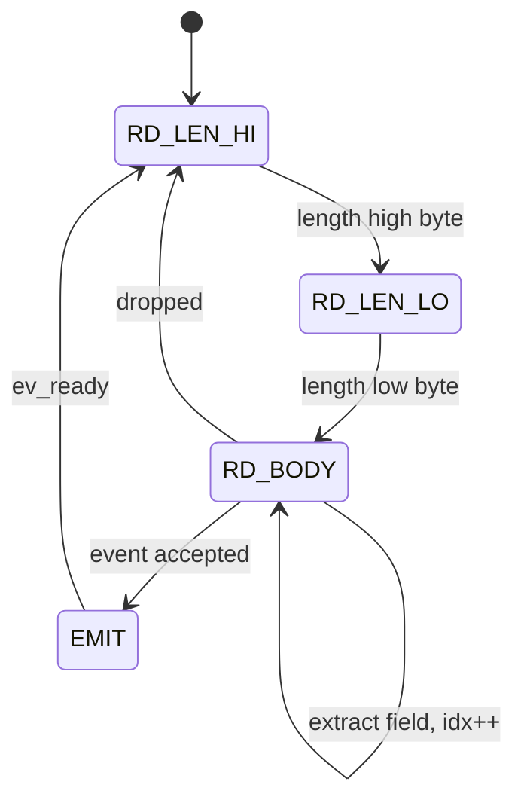
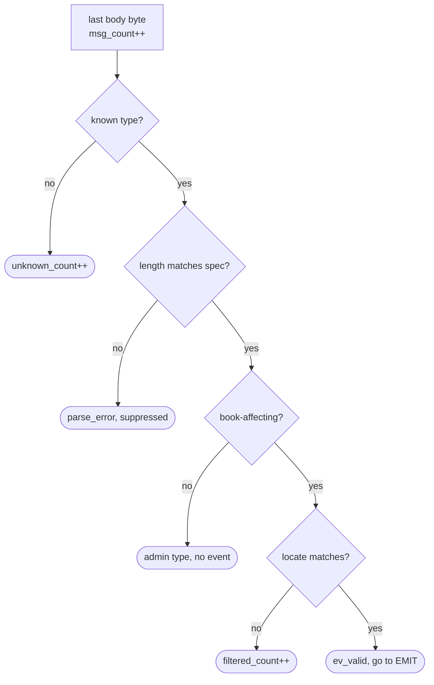
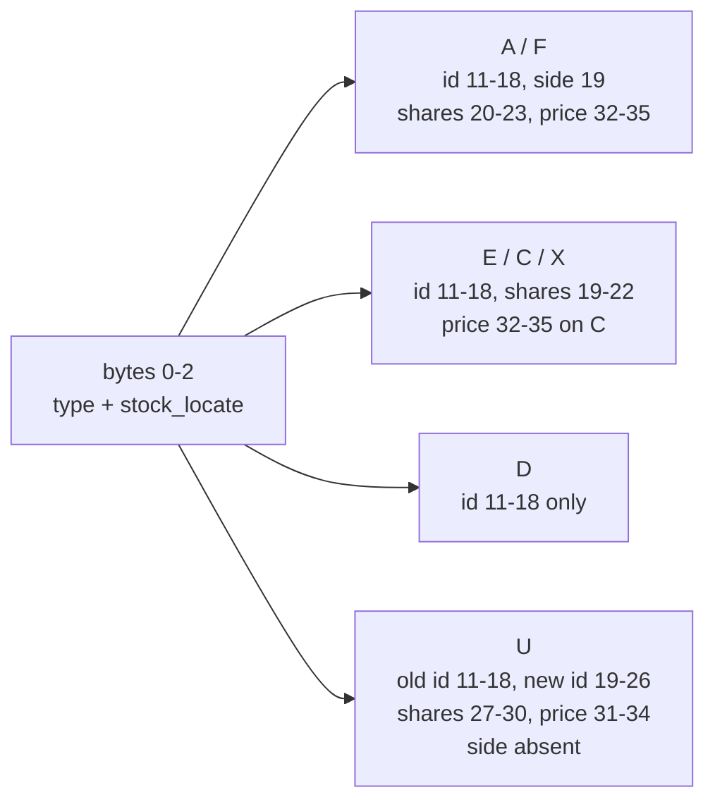

# `itch_parser`

Byte-serial decoder for the NASDAQ historical-file framing. Source:
[`rtl/ITCH50_parser/Itch_parser.sv`](../../rtl/ITCH50_parser/Itch_parser.sv)

[← back to README](../../README.md#5-the-parser)

---

## 1. State machine

Four states. `s_tready = (state != EMIT)` — the single point of back-pressure in
the core.

## 2. End-of-message decision

The four outcomes at `idx == msg_len - 1`, in the order the RTL tests them.

**Why a length mismatch suppresses the event.** If the framing prefix disagrees
with the spec length for a recognised type, upstream framing is misaligned — which
means every field offset in this message is untrustworthy. Emitting a plausible
looking event from misaligned bytes is worse than emitting nothing.

## 3. Field extraction by type

Big-endian assembly: each arriving byte shifts into the low end, so the value is
complete and correctly ordered after the last byte. No buffering, no reversal.

`stock_locate` sits at the **same offset in every message type**. That is what
makes single-instrument filtering a two-byte comparison rather than a per-type
decode, and it is why the filter can be applied after field extraction without
costing anything.

## 4. Cost per message

Deterministic — one byte per cycle while `s_tvalid` holds, so the only variable
is time spent in `EMIT`.

| Type | Body | Cycles | @ 100 MHz |
|---|---:|---:|---:|
| `D` Delete | 19 B | 21 | 210 ns |
| `X` Cancel | 23 B | 25 | 250 ns |
| `E` Execute | 31 B | 33 | 330 ns |
| `U` Replace | 35 B | 37 | 370 ns |
| `A` Add | 36 B | 38 | 380 ns |
| `C` Exec w/ Price | 36 B | 38 | 380 ns |
| `F` Add + MPID | 40 B | 42 | 420 ns |

**This module is the core's bottleneck**, deliberately. One byte per cycle at
100 MHz is a 100 MB/s ingest ceiling; parsing one Execute costs 33 cycles against
roughly 18 for the entire rest of the pipeline. That is the right trade for a
1 Mbaud UART (1000× headroom) or 100 Mbps Ethernet (8× headroom), and it is the
first thing that breaks at gigabit line rate, where a 64-bit datapath and a
structurally different parser would be needed.

Synthesis, out of context, `xc7a200tfbg484-2`: **298 LUT, 360 FF, 0 BRAM, 0 DSP**,
WNS +4.953 ns against 10 ns. The register count is almost entirely `itch_event_t`
itself — 217 bits, two of them 64-bit order ids — which is the price of one event
shape covering every message type.
