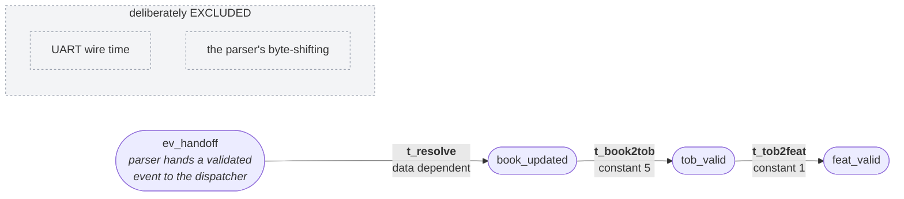
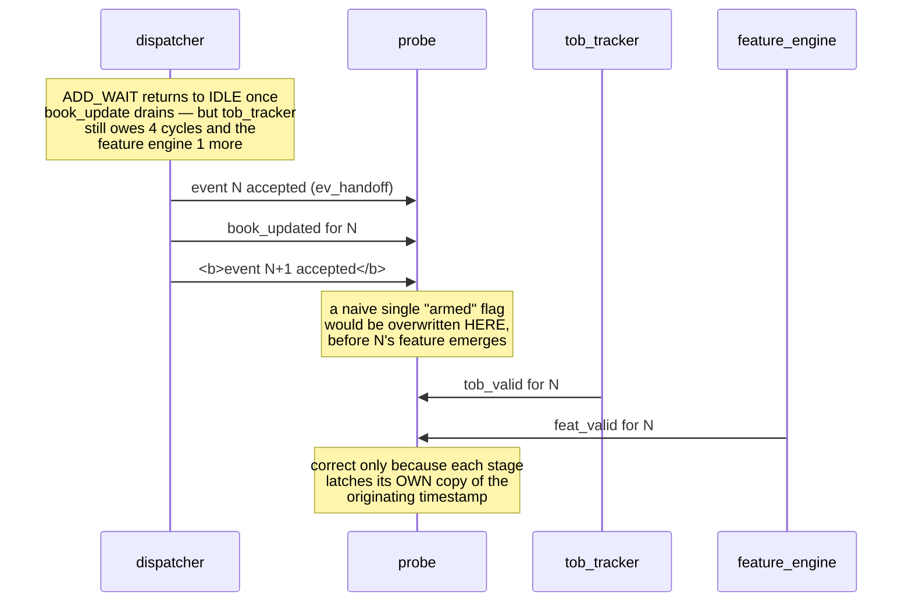
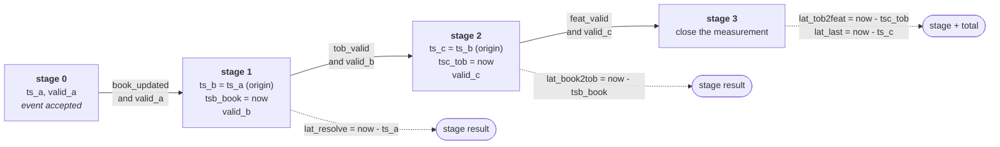
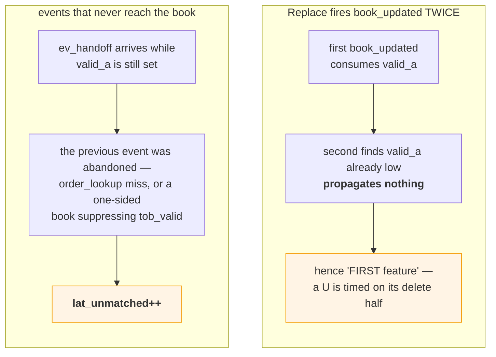
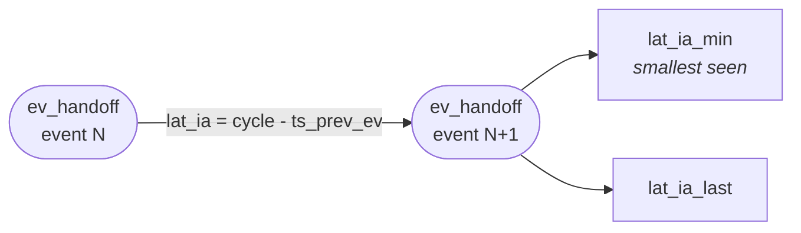
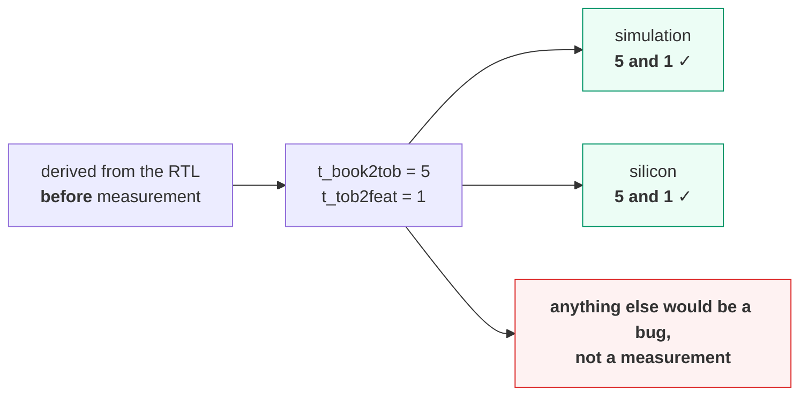

# `latency_probe`

Cycle-accurate latency instrumentation. Observation only — no back-pressure, no
handshake, no side effects. Removing the instance cannot change behaviour. Source:
[`rtl/ITCH50_parser/latency_probe.sv`](../../rtl/ITCH50_parser/latency_probe.sv)

[← back to README](../../README.md#103-latency)

---

## 1. Measurement definition

Quoting a latency number without stating what it spans is meaningless.

> **`t_total` = cycles from `ev_handoff` to the *first* `feat_valid` produced by
> that event.**

Excluding the transport is the entire point. The bring-up transport is ~1,363×
slower than the core, so any end-to-end number would be a measurement of the UART,
not of this pipeline.

## 2. Why timestamps travel with the event

A single "armed" flag would be clobbered constantly.

So the probe carries three independent timestamp pairs, and every subtract uses
only registers owned by that stage:

Each stage clears its predecessor's valid flag as it takes ownership, so exactly
one measurement occupies each stage.

## 3. Two edge cases the probe handles explicitly

**Why `lat_unmatched` has to exist.** Without it the probe would silently attribute
the *next* event's feature to the abandoned one — a wrong number that looks
perfectly plausible. Counting the abandonment is what makes the remaining samples
trustworthy.

## 4. Interarrival — measuring the transport on the same clock

Under UART, the interval between consecutive events **is** the transport cost. That
turns "the transport dominates the core by three orders of magnitude" from a
calculation into a measurement with both halves observed on the same chip, in the
same run, on the same clock:

| | Measured |
|---|---:|
| core, event → feature | **153 ns** |
| transport, minimum interarrival | **20,791 cycles = 207.9 µs** |
| ratio | **~1,363×** |

## 5. The probe as an assertion, not just an instrument

Both stages are fixed-latency chains with no data dependence, so their values were
predicted from the RTL first. They came back as 5 and 1 in simulation and again as
5 and 1 on hardware — which means the probe doubles as a live correctness check on
every run.

Simulation and silicon also agree on the extremes exactly (13 and 18 cycles), which
is expected: the pipeline is fully synchronous with no data-dependent stalls outside
`t_resolve`. An earlier analytical estimate of "~18 cycles for an Execute" turned
out to be the correct *upper* bound — the mean is lower because Add messages
resolve without the `order_lookup` round trip.

## 6. Results reported

11 free-running 32-bit outputs, wired into the status frame:

| Group | Outputs |
|---|---|
| Total | `lat_last`, `lat_min`, `lat_max`, `lat_sum`, `lat_count` |
| Per stage | `lat_resolve`, `lat_book2tob`, `lat_tob2feat` |
| Transport | `lat_ia_last`, `lat_ia_min` |
| Health | `lat_unmatched` |

The host computes the mean as `lat_sum / lat_count`. `cycle` wraps every ~43 s at
100 MHz; every subtract is modulo-2³², so a measurement spanning a wrap is still
correct as long as the interval itself is under 2³² cycles.

Verified by `tb_latency_probe` — **35 assertions**, and validated by **mutation
testing**: replacing the per-stage timestamp carriers with a naive single "armed"
flag fails 5 assertions, all confined to the overlap scenario.
