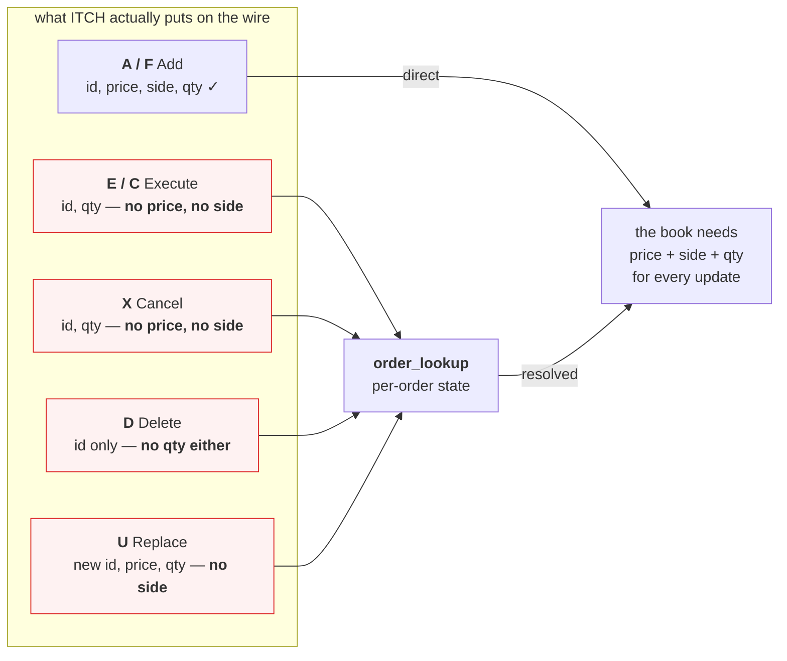
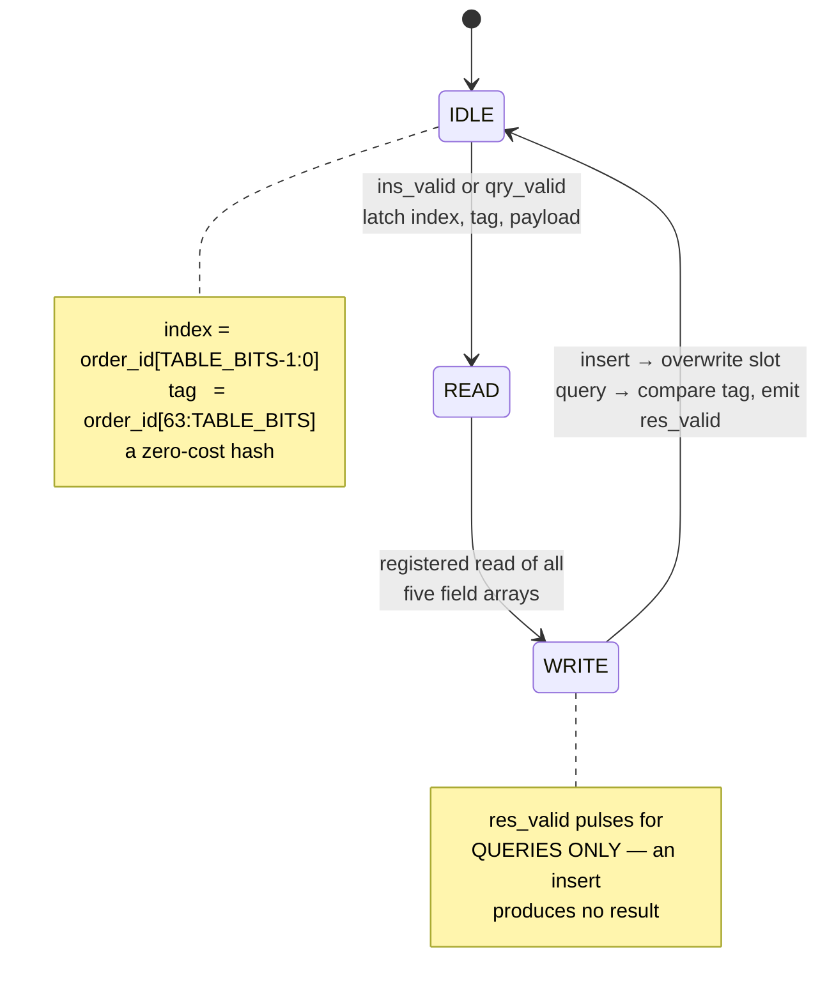
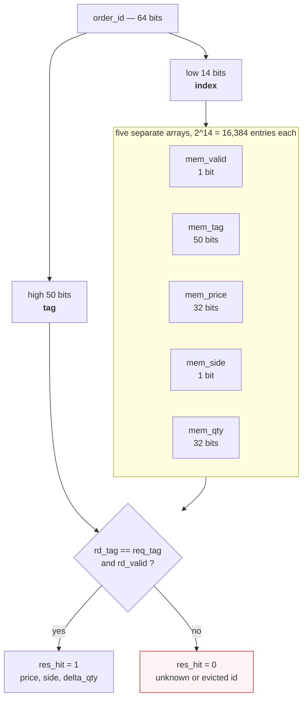
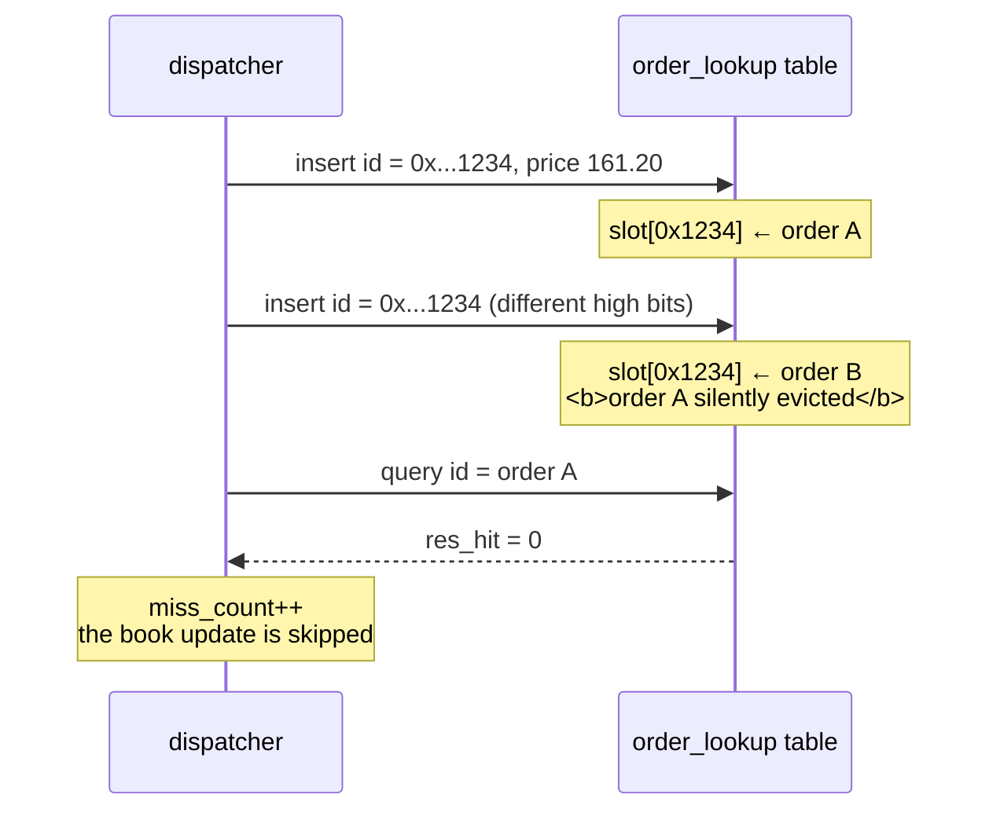
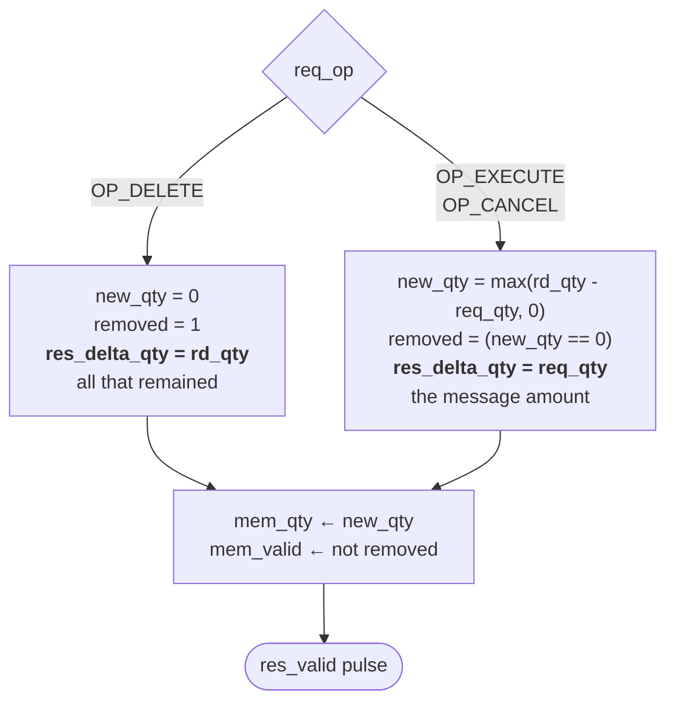

# `order_lookup`

Resolves price and side for messages that carry only an order reference number,
and tracks each order's remaining live quantity. Source:
[`rtl/ITCH50_parser/order_lookup.sv`](../../rtl/ITCH50_parser/order_lookup.sv)

[← back to README](../../README.md#6-the-order-book)

---

## 1. Why this module has to exist

ITCH is a *delta* protocol. Reconstructing a book from it is not optional state —
it is the whole problem.

## 2. State machine

Three states, 3 cycles per operation, one in flight. `busy` is high outside
`IDLE`; callers must hold their inputs while it is asserted.

## 3. Storage layout

**Why five arrays and not one struct array.** A single packed table of 16,384
entries would be roughly 1.9 Mbit, which exceeds Vivado's 1,000,000-bit
per-variable elaboration limit (`[Synth 8-4556]`). Split, each array is under the
limit and infers its own BRAM — and BRAM powers up to zero, so `mem_valid` starts
all-invalid with no explicit reset loop.

## 4. Collision policy, and why the golden model must copy it

The index is the low bits of the order id with no rehashing. Two live orders can
share it.

This is a **deliberate simplification**, valid because the live order count for a
single instrument stays well under 2¹⁴. If `miss_count` shows otherwise, the fix is
to raise `TABLE_BITS` (the AX7A200B has BRAM to spare) or add a DDR-backed L2.

> **The contract requires the Python model to reproduce this exactly.** An
> unbounded dictionary is not an acceptable substitute — it would never miss, so
> it would disagree with hardware on every evicted order and the differential test
> would be meaningless. The 200k capture drives **14,060 agreeing evictions**,
> which is the evidence that the model does reproduce it.

## 5. Per-operation semantics

The clamp on the subtract matters: a remove larger than what is resting indicates
an upstream inconsistency, but it must not wrap a 32-bit counter into a huge
positive quantity. The slot is freed the moment an order drains, which returns
capacity to the table without any garbage collection pass.

Verified by `tb_order_lookup` — **22 assertions**, including collision eviction
with `TABLE_BITS` shrunk to 4 to force it, Delete with no wire quantity, and
unknown-id misses.
