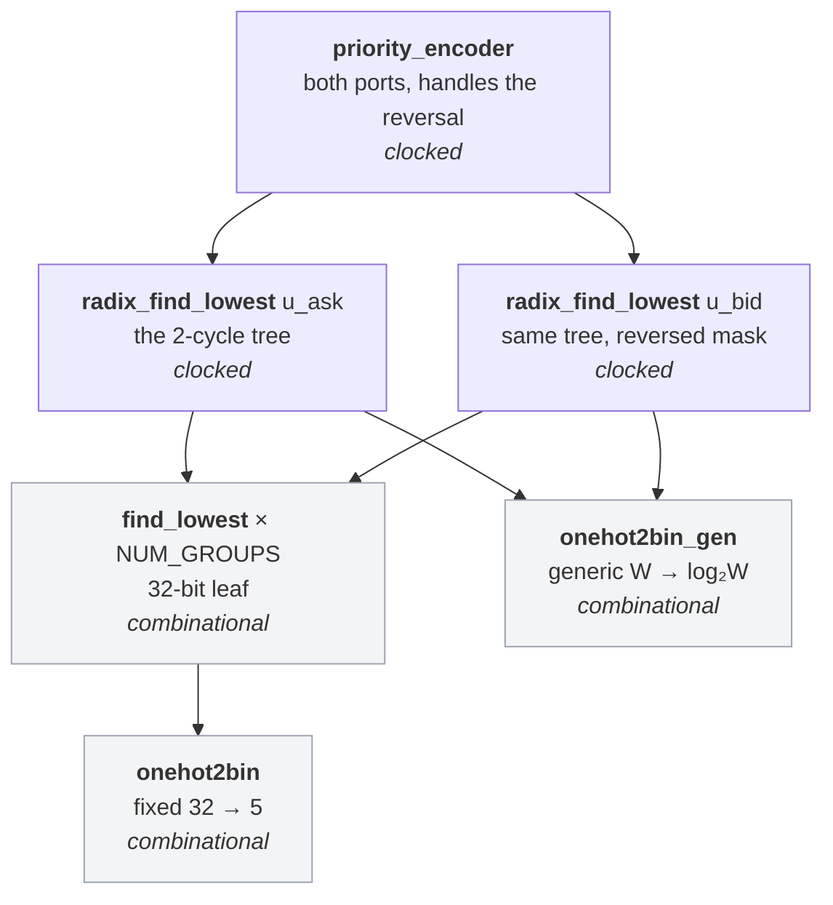
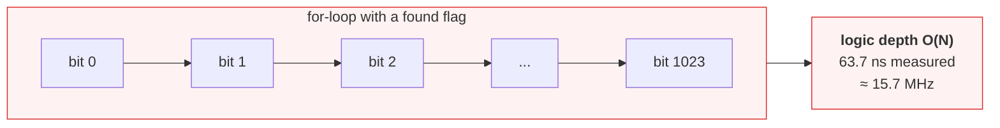
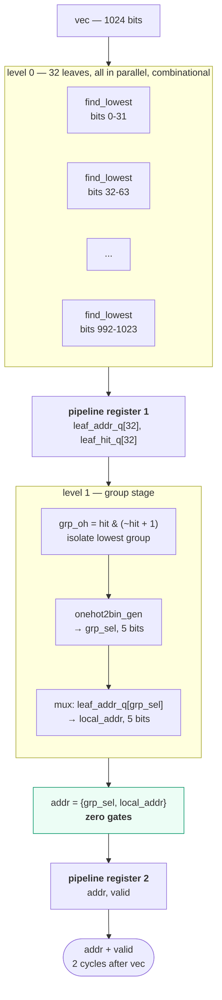
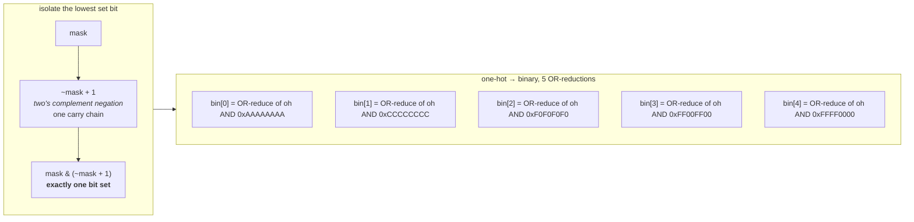
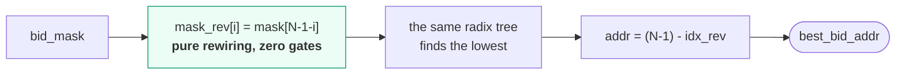

# `priority_encoder`

Finds the lowest and highest set bit of two wide occupancy masks — the best ask
and the best bid — at fixed 2-cycle latency. Source:
[`rtl/ITCH50_parser/priority_encoder_v2/`](../../rtl/ITCH50_parser/priority_encoder_v2/)

[← back to README](../../README.md#finding-the-best-bid-and-ask) ·
[full write-up](../../rtl/ITCH50_parser/priority_encoder_v2/README.md)

---

## 1. Module hierarchy

`onehot2bin_gen` exists because the two tree levels are only the same width at
`WINDOW_SIZE = 1024`. At 2048 the group level is 64 wide, at 4096 it is 128. The
fixed 32-bit version stays the leaf primitive.

## 2. Why the obvious implementation cannot work

A `for` inside `always_comb` is not a loop — there is no counter in hardware.
Synthesis unrolls it into 1024 physical copies wired **in series**, because
iteration *i* reads the `found` flag that iteration *i+1* writes. That serial
dependency is a carry rippling through 1024 stages. It is a structural limit, not
a synthesis-effort problem: no directive shortens a 1024-deep dependency chain.

## 3. The radix-32 tree

**Depth O(N) → O(log N).** 1024 serial stages become two shallow parallel levels.

**The concatenation is free.** `{grp_sel, local_addr}` *is*
`grp_sel × 32 + local_addr`, because `local_addr` is exactly 5 bits and 32 = 2⁵ —
no adder, no gates. This is why the radix must be a power of two, and why
`WINDOW_SIZE` must be a power-of-two multiple of 32.

## 4. The two primitives

`~x + 1` ripples a carry through the trailing ones of `~x` — the trailing *zeros*
of `x` — and stops at `x`'s lowest set bit, so `−x` agrees with `x` there and
disagrees above it. Constant depth.

For the encoder: bit *k* of the index is 1 exactly when the set bit lies at a
position whose index has bit *k* set, and each constant mask enumerates those
positions. Every output bit is an independent 16-input OR, about two LUT6 levels,
with no priority logic at all.

## 5. Highest set bit, for the bid side

Best ask is the lowest price with liquidity; best bid is the highest. One tree
serves both — reverse the mask, find the lowest, map the index back. The
subtraction form is exact for any power-of-two width, unlike the `~idx` trick the
superseded fixed-1024 ancestor used.

## 6. Results

Out-of-context synthesis, `xc7a200tfbg484-2`, both ports, 10 ns constraint.

| | **Tree, 1024** | **Tree, 2048** | **Ripple chain, 1024** |
|---|---|---|---|
| Latency | 2 cycles | 2 cycles | combinational |
| Slack @ 10 ns | **+3.795 ns** | **+2.055 ns** | — |
| Longest path | — | — | **63.692 ns** |
| **Fmax** | **161 MHz** | **126 MHz** | **15.7 MHz** |
| LUTs | 4,546 | 8,851 | 3,875 |
| Flip-flops | 406 | 792 | 0 |
| DSP / BRAM | 0 / 0 | 0 / 0 | 0 / 0 |

**Adding pipeline stages reduced wall-clock latency by 3.2×.** Two cycles of a
10 ns clock beat one pass through 63.7 ns of combinational logic outright — and at
this block's own 161 MHz, two cycles is 12.4 ns, a 5.1× improvement. Cycles only
mean something multiplied by a clock period you can actually achieve.

The area price is **17 % more LUTs** plus 406 flip-flops, in exchange for roughly
4× the achievable clock and removing a hard ceiling on every other module.
