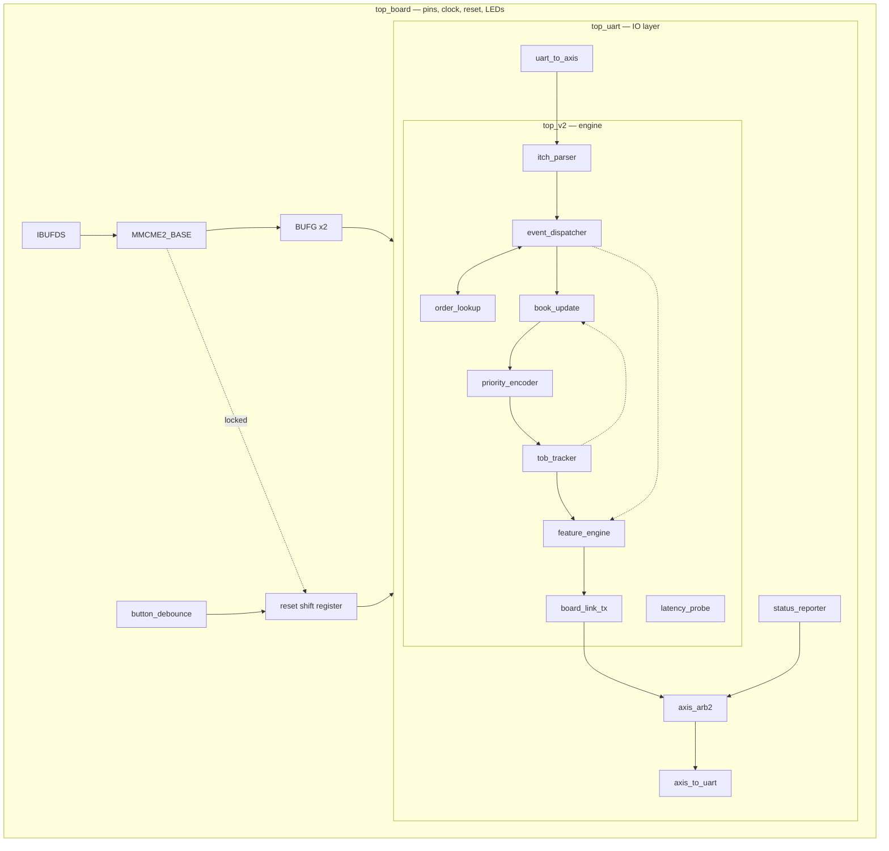
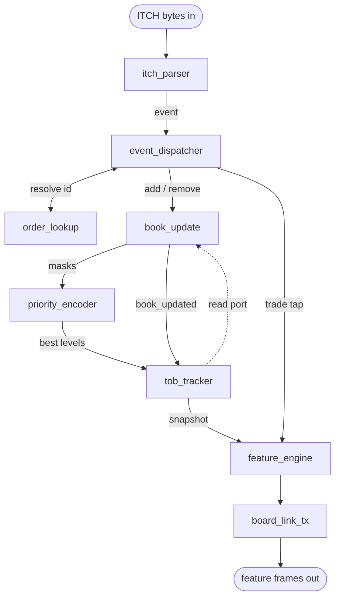
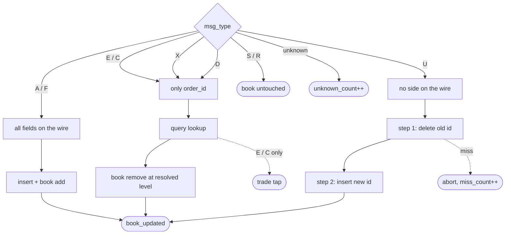
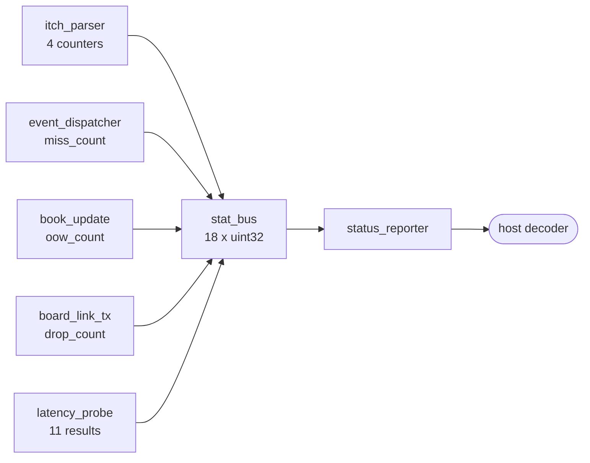

# System-Level Architecture

Generated from the RTL in `rtl/ITCH50_parser/`. Three views: the module
hierarchy as it is actually instantiated, the datapath with its handshake
types, and the diagnostic paths that run alongside it.

[← back to README](../../README.md)

---

## 1. Module hierarchy

Exactly what `create_vivado_project.tcl` builds, rooted at the synthesis top.

**Why the split is where it is.** `top_v2` has no UART in it — its output is a
plain byte stream with a ready/valid handshake. The transport is entirely a
`top_uart` concern, so replacing UART with a MAC or XDMA touches nothing inside
the engine. `top_board` exists only to own pins, the clock tree, reset and the
LEDs.

---

## 2. Datapath, with handshake types

One event is in flight end to end. `ev_ready` is high only when the dispatcher
is in `IDLE`, so the parser stalls the byte stream rather than queueing.

**Interface patterns** (numbering follows [`module_ports.md`](../module_ports.md)):

| | Shape | Rule |
|---|---|---|
| ① | `tdata` + `tvalid` / `tready` | transfer when both high; **will wait for you** |
| ② | `X_valid` + payload, gated by `ready`/`busy` | 1-cycle strobe; check the guard *first* |
| ③ | `X_valid` pulse, no handshake | catch it that cycle; **no retry** |
| ④ | bare wires | always reflect current state |

The distinction that causes the most bugs: a `*_valid` with a matching `*_ready`
will wait; a `*_valid` without one will not.

---

## 3. Per-message routing

Which blocks each ITCH message type actually touches.

Replace produces **two** book updates for one message, and therefore up to two
feature vectors. It is the most intricate path in the design and the one the two
smaller test captures never exercise.

---

## 4. Diagnostics

Nothing here is in the datapath. Every counter is monotonic from reset.

**The trigger is not a command byte, deliberately.** The inbound ITCH stream can
contain any byte value inside a price, order id or timestamp field, so an in-band
magic byte would eventually collide with real data and desynchronise the framing.
Watching for the RX line to go quiet is unambiguous and cannot corrupt the
datapath — and it fires at exactly the moment the host wants the counters, the
end of a replay burst.

On a board with no processor and no debugger, these counters *are* the debugger.
They are what identified a stale-device bug that looked exactly like an order-book
error — see §9.4 of the README.
