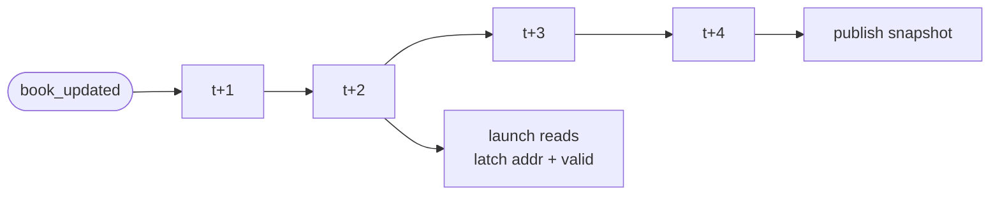
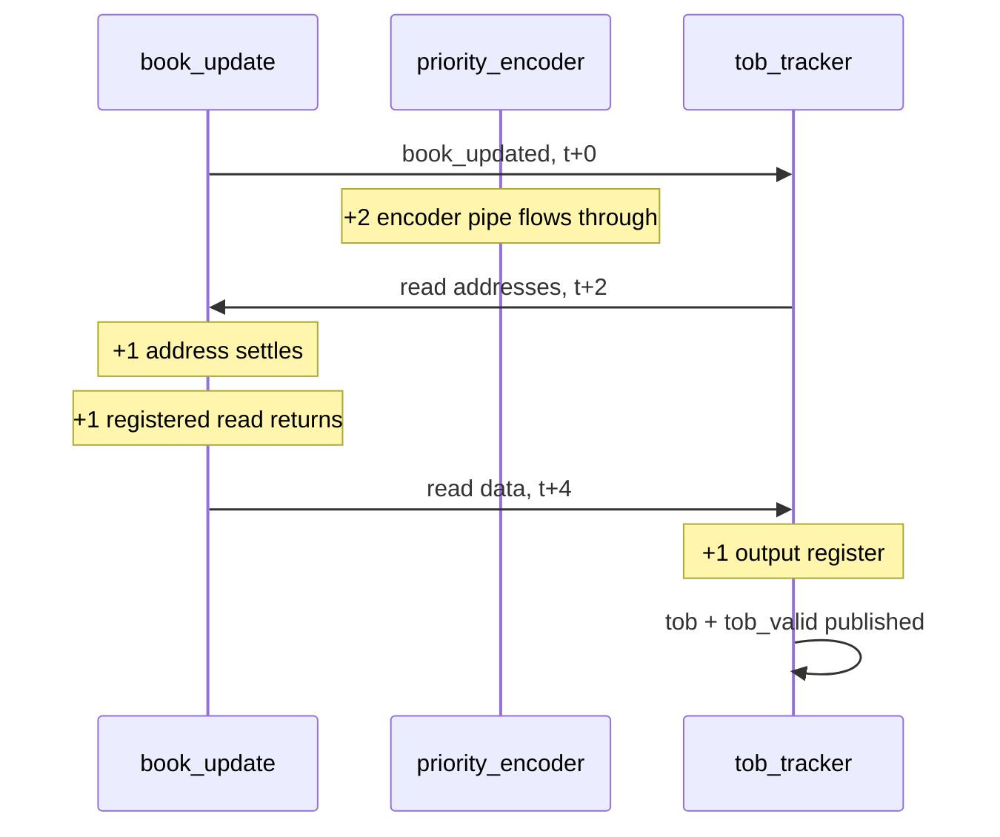
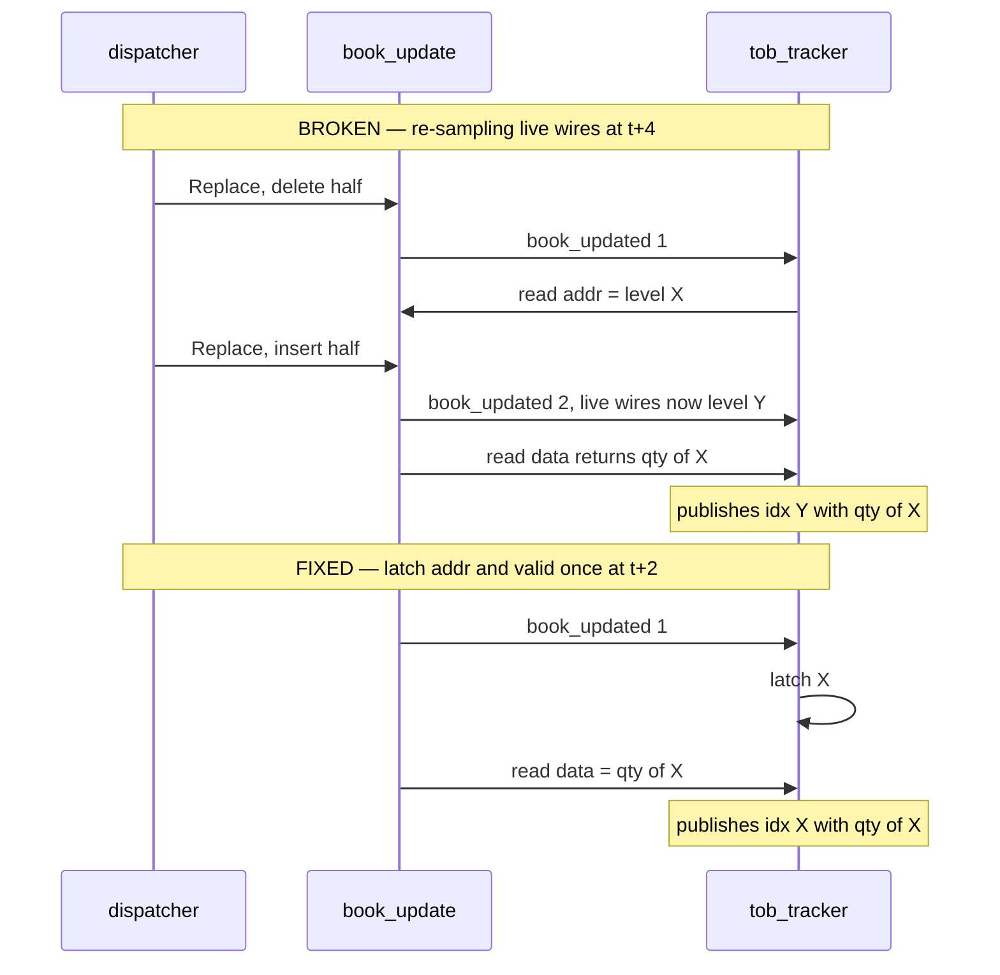
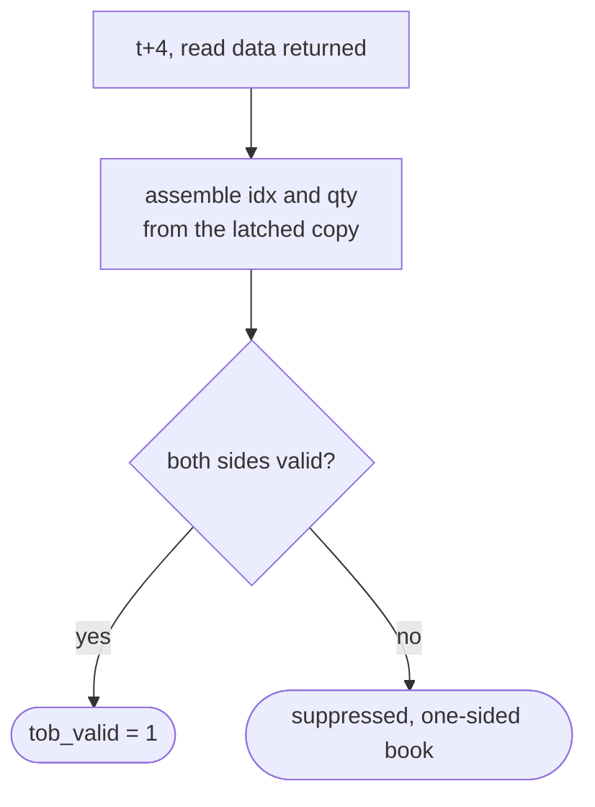
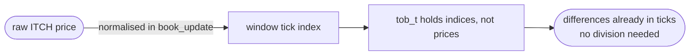

# `tob_tracker`

Assembles the top-of-book snapshot the feature engine consumes. Source:
[`rtl/ITCH50_parser/tob_tracker.sv`](../../rtl/ITCH50_parser/tob_tracker.sv)

[← back to README](../../README.md#6-the-order-book)

---

## 1. The delay line

No FSM — a 4-bit shift register off `book_updated` with exactly two taps.

The depth is **exactly 4 bits** because only those two taps are read. It was
`[4:0]`; bit 4 was written every cycle and never read, which synthesis dropped
but which misleads anyone counting pipeline stages from the source.

## 2. Where the 5 cycles go

| Stage | Cycles |
|---|---:|
| encoder pipeline | 2 |
| read address settle | 1 |
| registered read data | 1 |
| output register | 1 |
| **`t_book2tob`** | **5** |

This is a fixed-latency chain with no data dependence, so the value was derived
from the RTL *before* measurement. It came back as 5 in simulation and again as 5
on hardware — which is why `latency_probe` doubles as an online correctness check
rather than merely an instrument. Anything other than 5 is a bug, not a
measurement.

## 3. The race this module is built around

`best_bid_addr` and friends are **live combinational wires** from the encoder, not
latched values. An earlier version waited t+2 to latch the read *address*, then at
t+4 re-read the live wires again to assemble `tob.bid_idx`.

**Why the window is exactly wide enough to hit.** `event_dispatcher` fires a
Replace's delete and insert roughly 4–5 cycles apart — right inside this 4-cycle
delay line. So the bug is not a rare race, it fires on *every* Replace, and it is
invisible on any capture that contains none.

Verified by `tb_tob_tracker_backtoback` (9 assertions), and validated by
**mutation testing**: removing the t+2 address latch makes that testbench fail
while the single-update `tb_tob_tracker` still passes.

## 4. Publish condition

Both sides must exist. Features derived from a one-sided book would be
meaningless, so the snapshot is simply not published — which is one of the two
reasons an accepted event can produce no feature at all (the other is an
`order_lookup` miss). `latency_probe` counts both in `lat_unmatched`.

## 5. Prices stay as tick indices

This is the single decision that makes `DSP = 0` achievable. Carrying indices
rather than prices means `ask_idx − bid_idx` *is* the spread in ticks, with no
scaling step to divide by.
